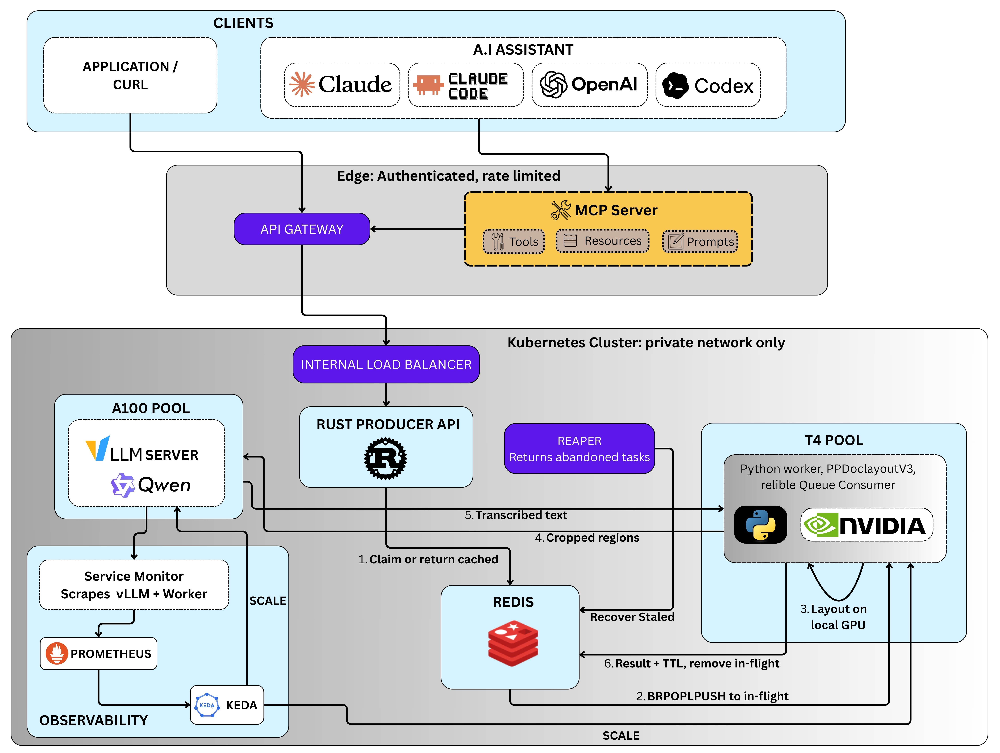

# **Visual Understanding System**

<p align="center">
  
</p>

## 1. Introduction
This is a document AI system that can read and understand documents. It uses OCR (Optical Character Recognition) to extract text from images of documents, and then applies natural language processing techniques to analyze and interpret the content.

You give this system a PDF or a photograph of a document. It gives you back clean, structured text: paragraphs in order, tables as real tables, maths as proper formulas, and written descriptions of the charts and pictures. It does this not with old-fashioned character matching but with a small AI model that actually looks at the page and reads it the way a person would. The whole thing runs on rented cloud computers with graphics cards, it wakes up when work arrives and goes back to sleep when there is none, and it is locked behind a private front door so nobody on the open internet can run up your bill.

## How should OCR actually work?
There's a critical debate in the SOTA (State of the Art) OCR landscape today.
There are two ways to build this kind of document AI system.
- **Approach 1: Single-stage / End-to-End:** Imagine you give the entire document to a multimodal model: The model gets the entire page and is expected to figure out:
    - where the paragraphs are
    - where tables are
    - where charts are
    - what the text says
    - what the table means
    - how everything is structured

    These models are typically around 2B to 5B parameters and can directly produce Markdown or parse layout.
    This is pretty attractive because it's simple. You could theoretically build:

    ```result = model.process(document)```

    And you're done. With less infrastructure, less orchestration and less code.
    But there's a massive drawback: **high hallucination**. Suppose you give the model a horrible scanned invoice, it isn't guaranteed to understand the physical structure perfectly. On a difficult document, it might accidentally 
    - merge columns
    - duplicate text
    - invent text
    - miss a row
    - associate a value with the wrong label
    - interpret a subtotal as the total
    - misunderstand a chart
    - rearrange information

    This is structural hallucination, it's not necessarily hallucinating an entire fictional story, but could simply be getting the document's structure wrong and that's potentially disastrous for invoices, financial reports, contracts, etc.
- **Approach 2: Two-stage hybrid pipeline:** Here, the problem is decoupled into two stages:
    1. **Stage 1:** A small, fast, and accurate OCR model, (PP-DocLayoutV3 via the GLM-OCR SDK) scans the document to identify, segment, and crop semantic regions (paragraphs, tables, formulas, charts). This model is trained to be very precise in recognizing characters, words, and their positions on the page.
    2. **Stage 2:** We pass those crops of high-resolution regions to a specialized LLM decoder (Qwen 3.5 4B) served on vLLM for transcription and contextual understanding.

    This approach reduces hallucination because the first stage ensures that the text and layout are accurately captured before any interpretation occurs. The second stage can then focus on understanding the content without being influenced by potential errors in text extraction.
    The firrst model, PP-DoclayoutV3 focuses on the physical structure of the document, while the second model, Qwen 3.5 4B, focuses on the semantic understanding of the content.
---
## 2. Vocabulary
- **OCR (Optical Character Recognition):** The process of converting images of text into machine-encoded text. It allows computers to read printed or handwritten text from scanned documents or photographs.

- **VDU (Visual Document Understanding):** The modern replacement for OCR. Instead of only asking "what letters are here", it asks "what is this document, and what does it mean".

    The difference matters enormously. Old OCR looking at an invoice returns a soup of numbers and words in roughly reading order. A VDU system looking at the same invoice can tell you that 4,200 is the grand total and 1,400 is a line item, because it understands the *layout*: what sits under what, what is in a bold box at the bottom right, what is in the table body versus the table footer.

    The same applies to charts. Old OCR sees a bar chart and returns the axis labels as loose words. A VDU system returns a sentence like "revenue rose steadily from Q1 to Q3 then dipped in Q4".

- **LLM (Large Language Model)**

    The kind of AI you already know: ChatGPT, Claude, Gemini. A very large statistical model trained on enormous amounts of text that can read, write, summarise, and reason. "Large" here means hundreds of billions of internal numbers (parameters). They are powerful, slow, and expensive to run.

- **SLM (Small Language Model)**

    The same kind of model, deliberately made small. Instead of hundreds of billions of parameters, an SLM has a few billion. The model this repository is configured to use, **Qwen 3.5 4B**, has roughly 4 billion parameters.

    Why would you want a smaller, less capable model? Because it fits on one graphics card, it answers much faster, and you can run thousands of requests through it for the price of a handful of requests to a big frontier model.

    The key insight of this project: **reading a document is a narrow job**. You do not need a model that can also write poetry, debug Rust, and discuss philosophy. You need one that is excellent at one thing. A 4-billion-parameter model trained
    specifically on document reading can beat a much larger generalist at this task while costing a fraction as much to run.

- **VLM (Vision Language Model)**
    Ordinary language models only take text as input. A VLM also takes images. The model in this system is a VLM: you hand it a cropped picture of a table plus a written instruction ("convert this table to Markdown") and it replies with text.

- **Layout Detection**
    Before the AI reads anything, a separate, simpler model draws boxes on the page and labels them: "this rectangle is a paragraph", "this one is a table", "this one is a chart", "this is a page header, ignore it".

    The model doing this here is called PP-DocLayoutV3. It is not a language model. It is a computer vision object detector, the same family of technology that finds faces in photos or pedestrians in self-driving car footage. It does not read anything. It only finds and labels regions.

- **Tokens**

    The unit AI models count in. Roughly, a token is a word fragment. "understanding" might be three tokens. An image gets converted into tokens too: a high-resolution crop of a dense table might become 6,000 tokens.

    Why you care: models charge by the token, run at a speed measured in tokens per second, and have a maximum number of tokens they can hold in mind at once. Every tuning number in this repository is ultimately about managing tokens.

- **GPU (Graphics Processing Unit)**
    A graphics card. Originally built for video games, now the standard hardware for AI because it can do thousands of simple maths operations simultaneously. AI is almost entirely simple maths done a staggering number of times.

    Two GPU models appear in this project:

    - **NVIDIA T4**: older, small, cheap. 16 GB of onboard memory. Used here for the layout detection.
    - **NVIDIA A100 80GB**: current-generation datacentre hardware. Extremely fast, extremely expensive (several dollars per hour to rent). Used here for the actual AI reading.

- **VRAM**
    The graphics card's own private memory. Separate from, and much faster than, your computer's normal RAM. A model has to fit entirely inside VRAM to run at full speed. This is why a 4-billion-parameter model is attractive: it fits in a few gigabytes, leaving the rest of the A100's 80 GB free for handling many requests at once.

- **Inference**
    Running a trained AI model to get an answer. Training is teaching the model (done once, by whoever made it, at enormous cost). Inference is using it (done millions of times, by you). This repository does inference only. Nothing here trains anything.

- **vLLM**
    The engine that runs the model. You could load an AI model with a hundred lines of Python, but it would serve one request at a time and waste most of the GPU.
    vLLM is specialised software that serves the same model to hundreds of simultaneous users efficiently.

    Its two headline tricks:

    - **Continuous batching**: instead of waiting to collect a fixed group of requests, processing them together, and then starting over, vLLM slots new requests into the group the instant an old one finishes. Like a bus that never stops moving and lets people on and off while rolling.
    - **PagedAttention**: a memory management trick borrowed from how operating systems handle RAM. It stops GPU memory from becoming fragmented and wasted, so you can fit far more simultaneous conversations on one card.

- **Kubernetes (often written k8s)**
    The software that runs your containers across a fleet of machines. You describe what you want ("one copy of the API, on a machine with a T4, with at least 8 GB of memory") and Kubernetes finds a machine, starts it, restarts it if it crashes, and moves it if the machine dies.

    Terms you will meet:

    - **Pod**: the smallest unit Kubernetes runs. In practice, one running container.
    - **Deployment**: your instruction for how many copies of a pod should exist.
    - **Service**: a stable internal address for a set of pods, so other parts of the system can find them even as individual pods come and go.
    - **Node**: one actual machine in the cluster.
    - **Node pool**: a group of identical machines. This project has four: cheap CPU machines for the API, high-memory machines for Redis, T4 machines for layout, A100 machines for the AI.
    - **Taint and toleration**: a "keep out" sign on a node pool, plus a matching permission slip on the pods that are allowed in. This is how the project stops a cheap background job from accidentally landing on an expensive A100 machine.
    - **PVC (PersistentVolumeClaim)**: a request for a shared disk that survives pods being destroyed. Used here to store the downloaded model files once, so every pod can read them instead of each downloading tens of gigabytes separately.

- **AKS and GKE**
    Managed Kubernetes. AKS is Microsoft Azure's version, GKE is Google Cloud's. Rather than installing and maintaining Kubernetes yourself, you rent it. This repository supports both, with a near-identical setup in each.

- **KEDA (Kubernetes Event-Driven Autoscaling)**
    The piece that watches for work and adds or removes machines automatically. Standard Kubernetes autoscaling watches CPU usage: if the processors are busy, add machines. That is useless for a GPU system, because a pod waiting on a GPU looks idle to the CPU.
    
    KEDA instead watches meaningful signals. In this project:

    - "How many documents are waiting in the queue?" If more than zero, start a layout worker.
    - "How many requests is the AI engine holding in its waiting room?" If more than zero, start another A100.
    - "Is it a weekday between 8am and 6pm New York time?" If so, keep one of each running so the first request of the morning is not slow.

    Crucially, KEDA can scale **to zero**. At 3am on a Sunday, the expensive GPU machines are shut off entirely and you pay nothing for them.

- **Redis**
    An extremely fast database that keeps everything in memory instead of on disk.
    Here it plays two roles at once:
    - **A queue**: a list of jobs waiting to be done.
    - **A filing cabinet**: the actual file contents and the finished results.

- **Rust and Axum**
    Rust is a programming language known for being extremely fast and extremely strict about memory safety. Axum is a web framework for Rust. The front door of this system (the part that receives uploaded files) is written in Rust because that job is pure plumbing at high volume: accept a 10 MB file, write it to Redis, reply. Rust does that with tiny memory usage and none of the slowdowns you get in garbage-collected languages under heavy load.

- **Async, Producer, Consumer**

    **Synchronous** means you wait. You ask a question and stand there until the answer comes.

    **Asynchronous** means you do not wait. You drop off your dry cleaning, you get a ticket, you leave, you come back later.

    This system is asynchronous. You upload a document and immediately get a `task_id` back. You come back later and ask "is task 4f2a done yet?".

    - The **producer** is the part that creates work and puts it on the queue (the Rust API).
    - The **consumer** is the part that takes work off the queue and does it (the Python worker).

    They never talk to each other directly. They only talk through the queue.

- **/dev/shm**
    On Linux, a folder that is secretly not a folder on a disk at all: it is a slice of RAM pretending to be a disk. Writing a file to `/dev/shm` is far faster than writing it to real storage, because nothing physically moves.

    This project uses it to hand documents between the worker's Python code and the OCR library without either of them waiting on storage.

- **MCP (Model Context Protocol)**
    A standard way to give an AI assistant a new tool. If you wrap this pipeline in an MCP server, then an assistant such as Claude Code can call it directly: "read this PDF for me" becomes something the assistant can simply do, without you writing any glue code.

- **API Gateway (Azure APIM / GCP API Gateway)**
    A guarded front door in front of your service. It checks who you are, counts how many requests you have made, blocks you if you make too many, and only then passes the request through.

    For a GPU system this is not merely security theatre. Without it, anyone who finds your address can upload thousands of documents, KEDA will dutifully spin up A100 machines to serve them, and you will get a bill for thousands of dollars. The gateway is a financial safety device as much as a security one.

---
## 3.  The Core Idea with an Analogy
Picture a busy restaurant. That is this system.

| The restaurant | This system | Folder |
| :--- | :--- | :--- |
| The host at the door who takes your order and hands you a buzzer | Rust API (Producer) | `realtime_producer/` |
| The ticket rail where orders hang waiting | Redis | `k8s/*/apps/redis-deployment.yml` |
| The prep cook who portions ingredients onto plates | Python Worker + layout detection | `realtime_consumer/` |
| The head chef who actually cooks each portion | vLLM + the SLM | `server/` |
| The stainless steel counter right between the two cooks | `/dev/shm` shared memory | configured in both |
| The manager who calls in extra staff when the rail gets long | KEDA | `k8s/*/apps/keda-scaler.yml` |
| The building itself, with its separate stations | Kubernetes cluster | `k8s/` |
| The locked door with a bouncer checking reservations | API Gateway | `k8s/aks/networking/` |

The single most important structural fact: **the host never waits for the
kitchen**. You hand over your document, you get a buzzer (a `task_id`), you
walk away. This is why the system can accept a thousand uploads in a burst while
only two cooks are on shift. The queue absorbs the burst.

The second most important fact: **the prep cook and the head chef are separate
people on separate hardware**. Chopping vegetables does not need a Michelin-star
chef, and a Michelin-star chef should never be idle waiting for someone to chop.
That is exactly the T4 versus A100 split.

---
## 4. The Five Components and What Each One Does

### Component 1: The Rust Producer API

**Where:** `realtime_producer/src/main.rs`

**Runs on:** cheap CPU-only machines (node pool `apinp`)

**Job:** accept files, hand out tickets, report status

Its job is basically to receive files without choking when lots of users hit the system simultaneously 

This is roughly 200 lines of Rust and it exposes exactly three endpoints:

The API receives the file, creates a task_id, puts the task into Redis, and immediately gives the client something like:
```json
{
    "task_id": "abc123",
    "status": "queued"
}
```
It doesn't perform OCR itself but just receives your job, puts it in line, then GPU workers process the jobs. This is asynchronous architecture.

| Endpoint | What it does |
| :--- | :--- |
| `POST /process` | You upload a file. It generates a unique ID, stores the file in Redis, adds the ID to the work queue, and immediately returns `{ task_id, status: "queued" }` with HTTP 202 Accepted. |
| `GET /status/{task_id}` | You ask about your ticket. It looks up the ID in Redis and returns the status, plus the result if it is finished, plus the error if it failed. |
| `GET /health` | Returns OK. Kubernetes pings this constantly to decide whether the pod is alive. |


Three details worth understanding:

**It accepts up to 10 MB.** Axum's default upload limit is around 2 MB, which
would reject most real PDFs. The code explicitly disables the default and sets a
10 MB ceiling. A ceiling still exists deliberately: without one, a single
attacker uploading a 5 GB file could exhaust the server's memory.

**It writes everything in one atomic operation.** All four fields (status,
filename, extension, file data) go into Redis in a single `HSET` command. This
matters because of a race condition: if the code wrote the status first and the
data second, a worker could grab the job in between and find an empty file. One
command means the worker either sees everything or nothing.

**It base64-encodes the file.** Binary file bytes get converted into a long
text string before being stored. This is done so the Python worker can reliably
read it back as text.

### Component 2: Redis, the State Store

**Where:** `k8s/aks/apps/redis-deployment.yml`

**Runs on:** high-memory CPU machines (node pool `redisnp`)

**Job:** hold the queue and hold the data

Redis stores exactly two kinds of thing:

1. A list called `ocr_tasks` containing task IDs waiting to be processed. This is the queue.
2. A hash per task, keyed `task:{id}`, holding status, filename, extension, the base64 file data, and eventually the result.

The queue is the shock absorber of the entire system. Uploads arrive in bursts (someone drags in 500 invoices at once). GPUs process at a steady rate. Without a buffer between them, either the API rejects uploads or the GPU is alternately overwhelmed and idle. The queue smooths this out completely.

Redis also acts as the signal KEDA watches. "Queue is 40 items long" is a directly meaningful statement about how much hardware you need right now, in a way that "CPU is at 60 percent" never is.

One clever touch: when the worker finishes, it writes `"data": ""` back to Redis, deliberately blanking the stored file. The 10 MB base64 blob is no longer needed once the text has been extracted, and Redis lives entirely in RAM. Not clearing it would fill memory with completed work.

### Component 3: The Python Consumer Worker

**Where:** `realtime_consumer/worker.py` and `realtime_consumer/config.yaml`

**Runs on:** T4 GPU machines (node pool `gpunpt4`)

**Job:** pull work from the queue, find the regions on each page, orchestrate the reading

This is the brain of the pipeline, and it is only about 130 lines of Python. It
runs an endless loop:

**Step 1: Wait for a job.** It calls `brpop` on the `ocr_tasks` list, which
blocks (sleeps) until something appears. This is important: it does not
repeatedly ask "anything yet? anything yet?", which would burn CPU. It sleeps
until Redis wakes it.

**Step 2: The collector window.** Once one job arrives, instead of processing it
immediately, the worker waits up to 100 milliseconds to see whether more jobs
turn up, collecting up to 4 in total.

**The analogy:** a lift that waits three seconds before closing its doors. You
lose three seconds on the first passenger and save an entire round trip when
four people get in. 100 milliseconds is imperceptible to a user and lets the
GPU process four pages in a single pass rather than four separate passes, each
with its own fixed setup cost.

**Step 3: Write the files to RAM.** Each file is decoded from base64 and written
to `/dev/shm/{task_id}.{ext}`, then given read permissions (`0o644`) so that any
sub-process the OCR library spawns can open it regardless of which user account
it runs as. This is a small but genuinely production-hardened detail: it is the
kind of thing that only shows up when you actually deploy.

**Step 4: Hand off to the OCR engine.** The worker calls
`ocr_engine.parse(temp_paths)` with the file paths, not the file contents. The
library decides how to handle each file by looking at its **name**: a file ending
in `.pdf` is treated as a PDF, anything else as an image. PDFs get rasterised into
images at 200 DPI. Images are loaded directly. This is why the worker names each
temporary file with the extension from the original upload.

**Step 5: Layout detection runs on the local T4.** PP-DocLayoutV3 draws boxes on
each page and assigns each one of 25 possible labels: `text`, `table`,
`display_formula`, `chart`, `doc_title`, `header`, `footer`, `seal`, and so on.

**Step 6: Regions get sorted into buckets.** The config file maps each label to
one of four fates:

| Fate | Labels | Meaning |
| :--- | :--- | :--- |
| `text` | paragraphs, titles, abstracts, references | Send to the AI with a "transcribe this" prompt |
| `table` | tables | Send to the AI with a "convert to Markdown table" prompt |
| `formula` | display and inline formulas | Send to the AI with a "convert to LaTeX" prompt |
| `skip` | charts, images | Keep the region, do not transcribe it |
| `abandon` | headers, footers, page numbers, footnotes | Throw away entirely |

This bucketing is where a lot of the quality comes from. Page furniture (running
headers, page numbers) is noise that would pollute the extracted text, so it
never reaches the AI. Different content types get different instructions, so the
model knows a table should come back as a table.

**Step 7: Regions go to the AI, up to 512 at a time.** The `max_workers: 512`
setting means the worker fires up to 512 concurrent requests at the vLLM server.
This number is chosen deliberately to match vLLM's own `MAX_NUM_SEQS=512`: the
worker is sized to exactly fill the engine's capacity and no more.

**Step 8: Assemble and store the result.** The pieces come back, get stitched
into a single Markdown document plus a JSON structure describing the layout, and
both get written to Redis with `status: "done"`.

**Step 9: Clean up.** The temporary files in `/dev/shm` are deleted in a
`finally` block, so they get removed even if processing crashed. Forgetting this
would slowly fill the RAM disk (limited to 4 GB in the manifest) until the pod
died.

### Component 4: The vLLM Inference Server

**Where:** `server/Dockerfile` and `server/entrypoint.sh`

**Runs on:** A100 80GB GPU machines (node pool `gpunpa100`)

**Job:** actually read the cropped regions

This component is almost entirely configuration. `entrypoint.sh` is a shell
script that launches `vllm serve` with a carefully chosen set of flags. Each
flag is a decision:

| Setting | Value | Why |
| :--- | :--- | :--- |
| `--gpu-memory-utilization` | 0.9 | Use 90 percent of the card's memory. The remaining 10 percent is safety margin against out-of-memory crashes. |
| `--max-model-len` | 16384 | The longest single conversation the model will handle, in tokens. Deliberately *reduced* from the default. A 6,000-token image plus 8,000 tokens of output fits comfortably in 16,000. Setting it higher would make vLLM reserve memory for conversations that never happen, leaving less room for concurrent requests. |
| `--max-num-batched-tokens` | 262144 | How many tokens can be processed in one forward pass. This is the big one. At the default, only about 5 image crops could be loaded at once. At 262,144, roughly 42 can. This directly removes the biggest bottleneck. |
| `--max-num-seqs` | 512 (via config) | How many conversations can be in flight simultaneously. |
| `--enable-chunked-prefill` | on | Splits the work of loading a large image into smaller pieces so it does not block requests that are already mid-answer. Without this, one big image causes a latency spike for everyone. |
| `--limit-mm-per-prompt` | 1 image, 0 video | One image per request, no video. Prevents a malformed request from consuming unbounded memory. |
| CUDA graphs (left on) | default | vLLM pre-compiles the sequence of GPU operations at startup instead of dispatching them one at a time. Makes startup slower and generation much faster. |

**The mental model for these numbers:** imagine a restaurant kitchen. `max-model-len`
is how big a plate you set aside per order (set it too big and you run out of
plates). `max-num-batched-tokens` is how many orders the prep station can lay
out at once. `max-num-seqs` is how many tables you will seat. All three have to
be balanced against the same fixed 80 GB of counter space.

### Component 5: KEDA, the Autoscaler

**Where:** `k8s/aks/apps/keda-scaler.yml`

**Job:** turn expensive machines on when needed and off when not

Three separate scaling rules, each watching a different signal:

**The Rust API** scales from 1 to 5 copies based on CPU usage crossing 70 percent. This is conventional scaling and it is appropriate here because the API genuinely is CPU-bound.

**The T4 layout worker** scales from 0 to 10 copies based on the Redis queue containing at least 1 item. That threshold is unusually aggressive: normally you would wait for a queue of several items before adding hardware. The reasoning is that the worker processes one batch at a time and blocks, so a second pending task genuinely needs a second worker rather than waiting behind the first.

**The A100 inference server** scales from 0 to 4 copies based on a Prometheus
metric, `vllm:num_requests_waiting`, crossing 1. In plain terms: "if the AI
engine has even one request sitting in its waiting room, start another A100".

**All three also have a cron rule** keeping one copy alive on weekdays from 8am
to 6pm New York time. This is the "warm start". Loading a model onto a GPU and
compiling CUDA graphs takes minutes; without the warm start, the first person to
upload a document each morning would wait several minutes for the machine to
boot, the driver to load, and the model to initialise. The cron rule pays for a
few idle hours to avoid that.

The `cooldownPeriod: 300` means the system waits 5 minutes of quiet before
shutting a machine down, so it does not thrash on and off during a stream of
sporadic requests.

---
## 5. The Life of a Single Document

Follow one invoice through the whole system.
```
User
  │
  │ Upload invoice.pdf
  ▼
API Gateway
  │
  │ Security + rate limits
  ▼
Rust API
  │
  │ Create job
  ▼
Redis Queue
  │
  │ "Someone needs this processed"
  ▼
T4 Worker
  │
  │ Find what's on each page
  ▼
PP-DocLayoutV3
  │
  │ "This is a table"
  │ "This is text"
  │ "This is a footer"
  ▼
Crop useful regions
  │
  ▼
vLLM + Qwen
  │
  │ Actually read/understand each region
  ▼
Results
  │
  ▼
Reassemble document
  │
  ▼
Redis
  │
  ▼
User gets Markdown + JSON
```

**Second 0.00.** You run `curl -X POST .../process -F "file=@invoice.pdf"`. The PDF is submitted to the document-processing system. The request hits the API Gateway first. The gateway checks your API key or JWT
token, checks you have not exceeded 100 requests per minute, and forwards you to the Internal Load Balancer, which forwards you to the Rust API pod.

```
Internet
   ↓
API Gateway
   ↓
Internal Load Balancer
   ↓
Rust API
```

**Second 0.01.** The Rust API receives the file,reads the multipart form, finds the field named `file`, and extracts the filename `invoice.pdf` and extension `pdf`. It generates a UUID, say `4f2a...`, converts the PDF bytes to base64, and writes one `HSET` to Redis creating `task:4f2a` with status `queued`. It then pushes `4f2a` onto the `ocr_tasks` list.

**The Rust API converts the PDF bytes into base64 before storing them in Redis. Why base64?** A PDF is binary data, made up of 1s and 0s: `101010101010...`. Redis is a text-based database, and while it can store binary data, it is safer and more portable to encode binary data as text. Base64 encoding converts the binary data into a string of ASCII characters `JVBERi0xLjQKJ...`, which can be safely stored and transmitted in text-based systems like Redis.

**Second 0.02.** Redis now receives the job and then puts `4f2a` into `ocr_tasks`. Think of `ocr_tasks` as a waiting line.
```
ocr_tasks

┌────────┐
│ 4f2a   │
├────────┤
│ 91ab   │
├────────┤
│ 72cd   │
└────────┘
```
As far as you are concerned, the job is submitted. You are free to go. This is where the architecture starts becoming asynchronous. The API's job is essentially to accept the work and put it in line. It doesn't need to perform the expensive processing itself.

You receive 
```JSON
{"task_id": "4f2a...", "status": "queued"}
``` 
with `HTTP 202`.

The important part isn't the number 202. It means roughly:
"I accepted your request, but I haven't finished processing it yet."

This is very different from:

```JSON
HTTP 200
{
   "result": "..."
}
```
The API is saying: "Your job has entered the system. Here's your tracking number." You can now walk away.

**Why is this architecture useful?**
Imagine OCR takes 30 seconds. Without asynchronous processing, we'd have a workflow like this:

```
POST /process

       ↓
   wait 30 sec
       ↓
    response
```
If 1,000 people do this simultaneously, your API becomes a mess.

But With the queue:
```
POST
 ↓
"Task accepted"
 ↓
202
```
The expensive processing happens separately. This is the classic `Producer → Queue → Consumer` architecture.

**Second 0.03.** KEDA's poll notices the queue is no longer empty. If no worker is running, it tells Kubernetes to create one. Kubernetes asks the cluster autoscaler for a T4 machine. (If a warm worker is already running, skip ahead.)

**Why does KEDA matter?**
Imagine no documents are being processed.
You don't want:
```
A100 GPU
T4 GPU
T4 GPU
T4 GPU
```
sitting there doing absolutely nothing while charging you money. So,
```
No work
 ↓
0 workers
 ↓
$0 GPU compute
```
Then:

```
Work arrives
 ↓
KEDA
 ↓
Kubernetes
 ↓
GPU worker starts
```
This is event-driven autoscaling.

**Second 0.04.** A worker's `brpop` returns `4f2a`. The worker starts its 100 ms collection window, checking for more tasks.

The worker uses `brpop` to retrieve the next task from Redis.
Conceptually:
```
Redis:

[4f2a, 91ab, 72cd]

       ↓

Worker takes 4f2a

Redis:

[91ab, 72cd]
```
But it doesn't immediately process `4f2a` which is clever, the worker instead waits 100 ms to see if more tasks arrive, because GPUs are much more efficient when processing a batch. This is like a lift that waits a few seconds before closing its doors, allowing more passengers to enter.

Suppose these arrive almost simultaneously:
```
Invoice A
Invoice B
Invoice C
```
Instead of:

```
GPU → A
GPU → B
GPU → C
```
the worker can do:

```
GPU
 ↓
[A, B, C]
```

That's dynamic batching.


**Second 0.14.** The window closes. Say two other invoices arrived, so the batch is 3 documents. The worker sets all three to `processing` in Redis.

After the 100 ms window:
```
Batch = 3 invoices
```
Now the worker changes their status:
```
queued
   ↓
processing
```
in Redis.

That's important because the system can now tell:
```
Task 4f2a
Status: processing
```
rather than 
```
queued
```

The worker decodes the base64 back into the original PDF bytes for each task and writes them into `/dev/shm/`. `/dev/shm` is very fast RAM-backed temporary storage. The purpose is to avoid unnecessary disk I/O while handing the document between processing stages. The document is available locally and quickly for the next processing stages.

**Second 0.15. PDF becomes images** The worker calls `parse()` with the three paths. The library sees the `.pdf` extension on each file name, recognises them as PDFs, and rasterises the pages into images at 200 DPI.

The worker calls:
```
parse()
```
The document-processing library identifies the file as a PDF and rasterizes its pages. Rasterize simply means "Convert the PDF page into an image."

For example:
```
invoice.pdf

Page 1
Page 2
Page 3
```
becomes:

```
page1.png
page2.png
page3.png
```
at 200 DPI Because the next model isn't fundamentally looking at a PDF document. It's looking at visual information. So:
```
PDF
 ↓
Page images
 ↓
Computer vision
```

**Second 0.4.** PP-DocLayoutV3 runs on the local T4, processing pages 4 at a
time. It produces boxes: a `doc_title` at the top, several `text` paragraphs, a `table` in the middle, a `header` and a `footer` (both marked for discard), and a company `seal` in the corner.

This is the first AI stage. PP-DocLayoutV3 examines the page. Imagine the invoice looks like:
```
┌──────────────────────────────────┐
│         ACME CORPORATION         │ ← title
│                                  │
│ Invoice #: 12345                 │ ← text
│ Date: 01/09/2026                 │ ← text
│                                  │
│ ┌──────────────────────────────┐ │
│ │ Item │ Qty │ Price │ Total   │ │ ← table
│ │──────┼─────┼───────┼─────────│ │
│ │ ...                          │ │
│ └──────────────────────────────┘ │
│                                  │
│ Footer information               │ ← footer
└──────────────────────────────────┘
```
The model identifies regions. The output is essentially:
```
Region 1 → doc_title
Region 2 → text
Region 3 → text
Region 4 → table
Region 5 → footer
```
This is layout detection.

**Why does it detect headers and footers if they're going to be discarded?**

Because the model needs to understand the entire page structure. But the system has rules saying:
```
header → discard
footer → discard
```
Why?
Because a document often contains repetitive garbage. For example, every page might say:
```
ACME Annual Report
CONFIDENTIAL
Page 17
```
You don't necessarily want your final extracted content to contain that 30 times. So the pipeline can identify those regions and throw them away.

**Second 0.45.** The worker crops each keeper region out of the page image and
builds a request per region, attaching the right prompt for its type. The
table region gets "Convert this table image into a clean Markdown table format".
The paragraph regions get "OCR and recognize the text in this image".

This is where the two-stage architecture becomes very obvious.
Instead of sending the entire invoice to Qwen:
```
Entire page
 ↓
Qwen
```
The worker cuts it into useful pieces:

```
Page
 │
 ├── Title crop
 ├── Paragraph crop
 ├── Paragraph crop
 └── Table crop
```
Now Qwen gets targeted visual information. This is called dynamic cropping.
The full-page images are avoided because they're token-expensive; instead, semantic regions such as paragraphs, tables, formulas and charts are cropped.

**And here's a very important detail: different regions get different instructions**
The table receives something like: "Convert this table image into a clean Markdown table."

A paragraph receives: "OCR and recognize the text in this image."

Why? Because the task depends on what you're looking at. A table should become:
```
| Item    | Qty | Price  |
|   ---   |---  |---     |
| Laptop  | 2   | $2,000 |
| Monitor | 3   | $900   |
```
A paragraph should become: 
```
The company recorded revenue growth...
```
A formula should potentially become:
```
E = mc²
```
A chart might require a description. So the system isn't merely doing:
```
IMAGE → OCR
```

It's closer to:
```
IMAGE
 ↓
"What type of thing is this?"
 ↓
Choose appropriate processing instruction
 ↓
Model
```

That's context-aware document processing.

**Second 0.5.** All those requests fly at the vLLM service over HTTP, as
OpenAI-compatible chat completions with an image attached. Up to 512 can be in
flight at once.

The crops are sent to the vLLM server. Remember:
```
Qwen = the actual AI model
vLLM = the system serving that model efficiently
```
The requests are sent over HTTP. Conceptually:
```
Worker
 │
 ├── Table crop → vLLM
 ├── Text crop → vLLM
 ├── Text crop → vLLM
 ├── Chart crop → vLLM
 └── ...
```

**Second 0.5 to 1.1.** vLLM's continuous batching scheduler slots each request
into the running batch as capacity opens. The model reads each crop and
generates text. The table comes back as pipe-delimited Markdown, the paragraphs as clean prose.

The system can have many requests in flight. The worker is tuned for up to 512 concurrent region-recognition requests, matching the vLLM sequence capacity.

**vLLM now does the heavy lifting** This is where the A100 comes into play.
The requests arrive at the vLLM inference server. Instead of processing them one by one, vLLM continuously batches them. Imagine:

```
Requests arriving:

A ────────┐
B ────────┤
C ────────┼──→ vLLM → A100 → Qwen
D ────────┤
E ────────┘
```
As requests finish, new requests enter. That's the continuous batching idea.
The project explicitly tunes `MAX_NUM_SEQS=512` and `MAX_NUM_BATCHED_TOKENS=262144` to keep many image crops in flight and reduce the prefill bottleneck.

**Second 1.2.** The worker collects all the pieces, reassembles them in reading order, runs post-processing (merging split text blocks, attaching formula numbers to their formulas, normalising bullet points), and produces both a Markdown document and a JSON layout description.

**The worker reassembles everything**
This part is easy to overlook. Suppose Qwen returned:
```
Paragraph A
Table
Paragraph B
Title
```
The worker can't just concatenate them in whatever order responses arrived.
Remember: requests were processed concurrently. Maybe the table finished first. Maybe Paragraph B finished before Paragraph A. So the worker has to restore: the original reading order. It essentially reconstructs:

```
Title

Paragraph A

Table

Paragraph B
```
rather than:
```
Table

Paragraph B

Title

Paragraph A
```
That's an important piece of orchestration.

**Second 1.25.** The worker writes the result to `task:4f2a` in Redis, sets
status to `done`, and blanks the `data` field. It deletes the temp files from
`/dev/shm`.

**Post-processing**
After the AI produces its pieces, the system cleans them up. For example: 

**Split text blocks**. 

The layout detector might split one paragraph into:
```
Block A
Block B
```
The worker merges them back into:
```
One paragraph
```
**Formula numbering**

It might need to associate:
```
(1)
```
with the correct formula.

**Bullet normalization**

Different parts might produce:
```
•
-
*
```
The system can normalize them. So the final result isn't simply:
"Whatever Qwen spat out." There's a deterministic cleanup/reconstruction stage afterward.

**Whenever you like.** You call `GET /status/4f2a`. The Rust API reads the hash
from Redis and returns your Markdown and JSON.

**Five minutes later.** The queue has been empty for the whole cooldown period.
KEDA scales the worker to zero and the A100 to zero. The cluster autoscaler
releases the machines. You stop paying for them.

---

## 6. Repository Layout

| Folder or file | What it is |
| :--- | :--- |
| `realtime_producer/` | The Rust API. Receives files, hands out task IDs, reports status. |
| `realtime_consumer/` | The Python worker. Takes tasks off the queue, runs layout detection, sends regions to the model, saves results. Its `config.yaml` holds the prompts and the region rules. |
| `server/` | Packaging and launch flags for the vLLM inference server. No application code. |
| `k8s/aks/` and `k8s/gke/` | Kubernetes manifests for Azure and Google Cloud. Same system, two clouds. Set your container registry once in `kustomization.yml`. |
| `docs/` | Cloud account setup, GPU quota, and the full deployment guides. |
| `tests/` | Fixture documents and the container smoke test. Component tests live beside their code: `realtime_producer/tests/` and `realtime_consumer/tests/`. |
| `.github/workflows/ci.yml` | Runs every test suite on every push. |
| `docker-compose.test.yml` | Starts Redis and the API for the smoke test. |
| `images/` | Architecture diagram. |
| `NOTICE` | Attribution to the original work, as Apache 2.0 requires. |
| `system-explanation.md` | The long-form explanation of every component, written for a beginner. |
| `next-steps.md` | How to get it running, from a local test on your laptop to the full cluster. |
| `implementation-plan.md` | The verified gap register, the target architecture, and the phased plan for closing the gaps. |

## 7. Getting Started

Start with [next-steps.md](next-steps.md). It is organised as four tracks that get
progressively more real and more expensive. Track 0 proves the plumbing on your
own machine for free. Track 1 gets real document output without a GPU. Tracks 2
and 3 move to the cloud.

Do not skip to the cluster. The earlier tracks catch most mistakes at no cost.

## 8. Running the Tests

Everything below runs on a laptop with Docker and Python. No GPU, no cloud
account, no API key.

```bash
# Python worker: 10 tests, plus 3 marked as known bugs that must fail until fixed
cd realtime_consumer && pip install -r requirements-dev.txt && pytest -q

# Rust API: 10 tests. The two that need Redis skip themselves if REDIS_URL is unset.
cd realtime_producer && cargo test

# The built container, end to end: 21 checks
docker compose -f docker-compose.test.yml up --build -d
python tests/integration/smoke.py
docker compose -f docker-compose.test.yml down
```

The same three suites run in GitHub Actions on every push.

## 9. Project Status

This repository is a working system with known gaps, and it is being improved in
phases. The gaps are listed with evidence, and the phases with checklists, in
[implementation-plan.md](implementation-plan.md). Check the progress table at the
end of that document to see what has been done and what is still to come.

The most important things to know today:

- The pipeline works end to end, and has a test suite.
- It does not yet retry or recover work if a worker dies mid-task.
- It does not yet report failures honestly: a failed document can be marked done
  with empty output.
- The Model Context Protocol server that lets AI assistants use this as a tool is
  planned but not yet built.

Each of these has a phase assigned to it.

## 10. Licence and Attribution

This project is licensed under the Apache License, Version 2.0. See
[LICENSE](LICENSE) for the full text.

It is derived from the open-source "Production-Grade SLM-Powered OCR Course",
also licensed under Apache 2.0, and has been substantially modified. See
[NOTICE](NOTICE) for the attribution and a summary of what changed.
