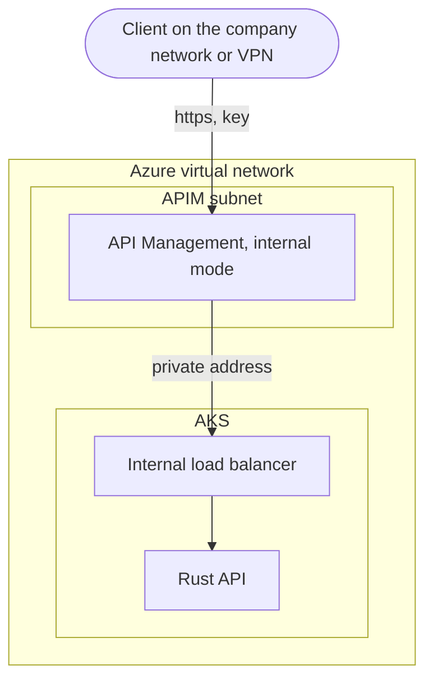

# Deploying on Azure (AKS)

This guide builds the whole system on Azure Kubernetes Service, from an empty
subscription to documents being read on GPUs, with an authenticated,
rate-limited front door. Every command is explained, and the checks in section
10 say exactly what you should see.

**What it costs.** From the moment the GPU machines exist you are paying for
them: an A100 machine costs several US dollars an hour. Read
[next-steps.md](../next-steps.md) section 11 (cost safety) first, set a budget
alert, and keep the teardown command in section 14 at hand.

**How it was checked.** The Azure-specific commands (registry, cluster, node
pools, API Management) were checked against Microsoft's current documentation;
they need a real subscription to run. Everything from section 7 onwards that is
plain Kubernetes (secrets, pod security, KEDA, the Prometheus stack, applying
the manifests, and every check in section 10 except the GPU ones) was rehearsed
end to end on a local test cluster on 30 September 2026, and the outputs shown
come from that rehearsal. Only the two GPU components could not run there.

## Contents

0. [Before you start](#0-before-you-start)
1. [Sign in and create the resource group](#1-sign-in-and-create-the-resource-group)
2. [Create the registry and the cluster](#2-create-the-registry-and-the-cluster)
3. [Add the four node pools](#3-add-the-four-node-pools)
4. [Install the GPU drivers](#4-install-the-gpu-drivers)
5. [Download the model weights into the cluster](#5-download-the-model-weights-into-the-cluster)
6. [Build the container images](#6-build-the-container-images)
7. [Configure the deployment](#7-configure-the-deployment)
8. [Create the secrets and turn on pod security](#8-create-the-secrets-and-turn-on-pod-security)
9. [Install KEDA and Prometheus, then deploy](#9-install-keda-and-prometheus-then-deploy)
10. [Check that everything works](#10-check-that-everything-works)
11. [Send documents and connect assistants](#11-send-documents-and-connect-assistants)
12. [The front door: Azure API Management](#12-the-front-door-azure-api-management)
13. [Optional features](#13-optional-features)
14. [Running it day to day](#14-running-it-day-to-day)
15. [When something goes wrong](#15-when-something-goes-wrong)
16. [References](#16-references)

---

## 0. Before you start

**Accounts and quota.** You need an Azure subscription on Pay-As-You-Go with
approved GPU quota for both A100 and T4 machines. If you do not have that yet,
work through [azure_onboarding.md](azure_onboarding.md) and
[azure_gpu_prereqs.md](azure_gpu_prereqs.md) first. The small test cluster
built at the end of `azure_gpu_prereqs.md` is unrelated to this one; delete it
if you still have it.

**Tools**, with the versions this guide needs:

| Tool | Check with | Needed |
| :--- | :--- | :--- |
| Azure CLI | `az version` | 2.72.2 or later (for the `--gpu-driver` option) |
| kubectl | `kubectl version --client` | any recent version |
| Helm | `helm version` | version 3 or 4 |
| openssl | `openssl version` | any (it comes with Git for Windows) |

**Which terminal.** Every command here is written for a Unix shell (bash). On
Windows, use Git Bash or WSL, not PowerShell. [next-steps.md](../next-steps.md)
section 4 explains why and how to set up WSL. Run everything from the
repository folder.

**Set these once per terminal.** Every later command reads them.

```bash
export LOCATION="eastus2"              # the region your GPU quota is in
export RESOURCE_GROUP="vdu-rg"         # any name; everything goes in here
export SUBSCRIPTION_ID="<your subscription ID>"
export AKS_NAME="vdu-aks"
export ACR_NAME="<your registry name>" # globally unique, lowercase letters and digits only
```

`export NAME="value"` stores a value under a name for this terminal, and
`$NAME` reads it back. If you open a new terminal, set them again.

---

## 1. Sign in and create the resource group

```bash
az login
az account set --subscription "$SUBSCRIPTION_ID"
az account show --output table
az group create --name $RESOURCE_GROUP --location $LOCATION
```

| Line | What it does |
| :--- | :--- |
| `az login` | Opens a browser to sign you in to Azure. |
| `az account set ...` | Chooses which subscription the following commands use. |
| `az account show ...` | Shows the chosen subscription. Its ID must match yours. |
| `az group create ...` | Makes the resource group: a folder in Azure that holds everything this guide creates, so deleting it later deletes everything. Running it again when the group exists is harmless. |

---

## 2. Create the registry and the cluster

```bash
# 1. The container registry: where your built images are stored
az acr create -g $RESOURCE_GROUP -n $ACR_NAME --sku Premium --location $LOCATION

# 2. The cluster
az aks create \
  --resource-group $RESOURCE_GROUP \
  --location $LOCATION \
  --name $AKS_NAME \
  --attach-acr $ACR_NAME \
  --node-count 1 \
  --enable-managed-identity \
  --enable-blob-driver \
  --network-plugin azure \
  --network-plugin-mode overlay \
  --pod-cidr 192.168.0.0/16 \
  --network-dataplane cilium \
  --generate-ssh-keys

# 3. Let kubectl talk to the new cluster
az aks get-credentials --resource-group $RESOURCE_GROUP --name $AKS_NAME
```

What the cluster options mean:

| Option | Why it is there |
| :--- | :--- |
| `--attach-acr $ACR_NAME` | Lets the cluster pull images from your registry without a password. |
| `--node-count 1` | One small machine for Kubernetes' own system pods. The system's own parts go on the pools in section 3. |
| `--enable-blob-driver` | Lets the cluster use Azure Blob storage as a shared disk, which is where the model weights will live (section 5). |
| The four `--network-*` flags | Azure CNI powered by Cilium. It enforces the network rules in `k8s/aks/networking/network-policies.yml`, the rules that decide which part may talk to which. Without a policy engine, Kubernetes accepts those rules and silently ignores them. |
| `--generate-ssh-keys` | Creates SSH keys for the machines if you do not have any. |

Creating the cluster takes several minutes.

---

## 3. Add the four node pools

A node pool is a group of identical machines. The system uses four, and every
part of it is pinned to the right pool by a label (for the CPU pools) or by the
pool's own name (for the GPU pools), plus a "keep out" taint so nothing else
lands on the expensive machines.

| Pool | Machine | What runs there | Label or taint |
| :--- | :--- | :--- | :--- |
| `gpunpa100` | `Standard_NC24ads_A100_v4`, one A100 80 GB | vLLM, the model server | taint `sku=gpunpa100` |
| `gpunpt4` | `Standard_NC16as_T4_v3`, one T4 16 GB | the worker (layout detection) | taint `sku=gpunpt4` |
| `redisnp` | `Standard_E4ds_v5`, high memory | Redis | label `app=redis-store`, taint `sku=redis` |
| `apinp` | `Standard_DS2_v2` | the API, the reaper, the MCP server | label `app=api-gateway`, taint `sku=api` |

```bash
# A100 pool for vLLM
az aks nodepool add \
  --resource-group $RESOURCE_GROUP \
  --cluster-name $AKS_NAME \
  --name gpunpa100 \
  --node-vm-size Standard_NC24ads_A100_v4 \
  --node-count 1 \
  --enable-cluster-autoscaler --min-count 0 --max-count 4 \
  --node-taints sku=gpunpa100:NoSchedule \
  --gpu-driver none

# T4 pool for the worker
az aks nodepool add \
  --resource-group $RESOURCE_GROUP \
  --cluster-name $AKS_NAME \
  --name gpunpt4 \
  --node-vm-size Standard_NC16as_T4_v3 \
  --node-count 1 \
  --enable-cluster-autoscaler --min-count 0 --max-count 4 \
  --node-taints sku=gpunpt4:NoSchedule \
  --gpu-driver none

# High-memory pool for Redis
az aks nodepool add \
  --resource-group $RESOURCE_GROUP \
  --cluster-name $AKS_NAME \
  --name redisnp \
  --node-vm-size Standard_E4ds_v5 \
  --node-count 1 \
  --enable-cluster-autoscaler --min-count 1 --max-count 3 \
  --node-taints sku=redis:NoSchedule \
  --labels app=redis-store

# Small CPU pool for the API, the reaper, and the MCP server
az aks nodepool add \
  --resource-group $RESOURCE_GROUP \
  --cluster-name $AKS_NAME \
  --name apinp \
  --node-vm-size Standard_DS2_v2 \
  --node-count 1 \
  --enable-cluster-autoscaler --min-count 1 --max-count 5 \
  --node-taints sku=api:NoSchedule \
  --labels app=api-gateway
```

The options that matter:

| Option | Meaning |
| :--- | :--- |
| `--node-count 1` | Start with one machine, so you can check the GPUs work in section 4. |
| `--min-count 0 --max-count 4` | The cluster autoscaler adds GPU machines when pods need them and removes idle ones, down to zero. KEDA (section 9) decides when pods are needed. |
| `--node-taints sku=...:NoSchedule` | Keeps every pod off the pool unless it explicitly tolerates that taint. The system's pods do; nothing else does. |
| `--gpu-driver none` | Tells AKS not to install NVIDIA's driver itself, because the NVIDIA GPU Operator will (section 4). This is Microsoft's documented way to use the GPU Operator. |

Two GPU notes. Do not add the `EnableManagedGPUExperience` tag that some older
guides show: it opts the pool into a separate preview feature that installs its
own driver, device plugin, and metrics exporter, which clashes with the GPU
Operator and, while in preview, does not support the cluster autoscaler. And
each pool starts with one machine, which you are paying for from now on.

---

## 4. Install the GPU drivers

The NVIDIA GPU Operator installs everything a GPU machine needs: the driver,
the plugin that tells Kubernetes the machine has a GPU, and an exporter for GPU
metrics. Its settings are in `k8s/aks/infra/gpu-operator-values.yaml`: they let
its pods onto the two tainted GPU pools, and turn on the GPU metrics that the
dashboard shows.

The operator loads kernel modules, so its namespace must be allowed privileged
pods. That is what the `label` line does; without it, its pods are refused.

```bash
helm repo add nvidia https://helm.ngc.nvidia.com/nvidia
helm repo update

kubectl create namespace gpu-operator
kubectl label --overwrite ns gpu-operator pod-security.kubernetes.io/enforce=privileged

helm upgrade --install gpu-operator nvidia/gpu-operator \
  --namespace gpu-operator \
  -f k8s/aks/infra/gpu-operator-values.yaml \
  --timeout 15m
```

`helm upgrade --install` installs the first time and updates after that, so the
line is safe to run again. `--timeout 15m` gives slow image downloads time to
finish (the default is 5 minutes).

**Wait for it** (3 to 10 minutes; the driver is compiled on each GPU machine):

```bash
kubectl -n gpu-operator rollout status ds/nvidia-driver-daemonset --timeout=10m
kubectl -n gpu-operator rollout status ds/nvidia-device-plugin-daemonset
kubectl -n gpu-operator rollout status ds/gpu-feature-discovery
```

**Check the GPUs are usable:**

```bash
kubectl get nodes "-o=custom-columns=NAME:.metadata.name,GPU:.status.allocatable.nvidia\.com/gpu"
```

Each A100 and T4 machine should show `1` in the `GPU` column. `<none>` on a GPU
machine means the operator's pods did not start there: check
`kubectl get pods -n gpu-operator` and the namespace label above.

---

## 5. Download the model weights into the cluster

The two models (PP-DocLayoutV3 for layout, Qwen3.5-4B for reading) are
downloaded once, inside Azure, onto a shared disk that every GPU pod reads.
Downloading them to your laptop and uploading again would take hours.

**1. Create the shared disk:**

```bash
kubectl apply -f k8s/aks/infra/provisioning/pvc.yaml
kubectl get pvc model-weights-pvc
```

The claim asks for 300 GB of Azure Blob storage that many pods can read at
once. `STATUS` should become `Bound` within a minute or two:

```
NAME                STATUS   VOLUME          CAPACITY   ACCESS MODES   STORAGECLASS             AGE
model-weights-pvc   Bound    pvc-37837be3... 300Gi      RWX            azureblob-fuse-premium   29s
```

**2. Only if a model you use is gated or private**, store your Hugging Face
token first. The two default models are public and need none.

```bash
kubectl create secret generic hf-token-secret --from-literal=token="<your Hugging Face token>"
```

**3. Run the download job:**

```bash
kubectl apply -f k8s/aks/infra/provisioning/ingest-job.yaml
kubectl logs -f job/model-weight-ingest
```

`logs -f` follows the job's output as it downloads each file in turn (Ctrl+C
stops watching, not the job). When it prints `Ingestion complete` for both
models, remove the finished job:

```bash
kubectl delete job model-weight-ingest
```

The job checks TLS certificates on every download, and it is the one container
in this system that runs as root: it writes to the shared disk once and is then
deleted. The note at the top of `ingest-job.yaml` explains why. A marker file
per model means running it again skips what is already there.

**4. Optional: look at what was downloaded.**

```bash
kubectl run weights-debug --rm -it --image=ubuntu:22.04 --overrides='
{
  "spec": {
    "containers": [{
      "name": "debug", "image": "ubuntu:22.04", "command": ["bash"],
      "stdin": true, "tty": true,
      "volumeMounts": [{"name": "weights", "mountPath": "/mnt/models"}]
    }],
    "volumes": [{"name": "weights", "persistentVolumeClaim": {"claimName": "model-weights-pvc"}}]
  }
}'
```

Inside it, `ls -R /mnt/models` should list `PaddlePaddle/PP-DocLayoutV3_safetensors`
(with `model.safetensors`, `config.json`, and a few more) and `Qwen/Qwen3.5-4B`
(with two `model.safetensors-0000X-of-00002.safetensors` files and the tokenizer
files). `exit` leaves and deletes the pod.

---

## 6. Build the container images

`az acr build` sends the folder to Azure and builds the image there, so you do
not need Docker running on your computer.

```bash
az acr build --registry $ACR_NAME --image ocr-api-rust:latest ./realtime_producer
az acr build --registry $ACR_NAME --image ocr-worker-rt:latest ./realtime_consumer
az acr build --registry $ACR_NAME --image ocr-reaper:latest --file realtime_consumer/Dockerfile.reaper ./realtime_consumer
az acr build --registry $ACR_NAME --image ocr-mcp:latest ./mcp_server
az acr build --registry $ACR_NAME --image ocr-vlm-qwen:latest ./server
```

| Image | What it is |
| :--- | :--- |
| `ocr-api-rust` | The API (the front counter). A few megabytes. |
| `ocr-worker-rt` | The worker, with the OCR SDK and the GPU libraries. About 8.7 GB. |
| `ocr-reaper` | The reaper (recovery and callbacks). Small. |
| `ocr-mcp` | The MCP server for AI assistants. Small. |
| `ocr-vlm-qwen` | vLLM, the model server. Large. |

Every image runs as an ordinary user (uid 10001; Redis as its own uid 999), and
the manifests mount each container's disk read-only. The worker and vLLM had
not yet run this way on real GPUs when this guide was written. If either fails
to start, its log names the path it could not write to; give it an `emptyDir`
volume at that path (as the manifests already do for `/tmp`) rather than
removing the restrictions.

---

## 7. Configure the deployment

Everything you would change lives in one file, `k8s/aks/kustomization.yml`.

**Your registry (required).** In the `images:` block, replace every
`<YOUR_ACR_NAME>` with your `$ACR_NAME`. The manifests use short image names,
and this block turns them into full addresses in your registry. If you skip it,
every pod fails with `ImagePullBackOff`.

**The settings (optional).** The `configMapGenerator` block lists the settings
every part reads. The defaults suit a first deployment; this is what each does:

| Setting | Read by | What it does | Default |
| :--- | :--- | :--- | :--- |
| `VDU_PROFILE` | API, worker | Which reading profile: `default`, `finance`, or `academic` (section 13). | `default` |
| `PIPELINE_VERSION` | API | Part of every cached result's name. Raise it after changing prompts so old cached answers are not reused. | `1` |
| `RESULT_CACHE` | API | Answer identical documents from the cache. | `true` |
| `RESULT_TTL_SECONDS` | worker, reaper | How long a finished result is kept. | `86400` (a day) |
| `TASK_MAX_AGE_SECONDS` | API | How long an unfinished task and its document may wait. | `172800` (two days) |
| `MAX_PDF_PAGES` | worker | PDFs with more pages are refused before reaching a GPU. | `200` |
| `MAX_ATTEMPTS` | worker, reaper | Tries per document before giving up. | `3` |
| `STALE_AFTER_SECONDS` | reaper | How long a claimed document may go unfinished before the reaper decides its worker died. Must be longer than your longest document takes. | `900` |
| `REAPER_INTERVAL_SECONDS` | reaper | How often the reaper checks. | `30` |
| `MAX_BATCH_SIZE`, `BATCH_WINDOW_MS` | worker | Up to how many documents are read together, and how long the worker waits to gather them. | `4`, `100` |
| `CALLBACK_ALLOWED_HOSTS` | API, reaper | Hosts that may receive callbacks. Empty means callbacks are off (section 13). | empty |
| `GLMOCR_OCR_API_HOST`, `GLMOCR_OCR_API_PORT` | worker | Where the worker sends cropped regions: the vLLM service. | `ocr-vlm-service`, `8000` |
| `SERVED_NAME`, `GPU_MEMORY`, `MAX_MODEL_LEN`, `MAX_NUM_BATCHED_TOKENS`, `MAX_NUM_SEQS` | vLLM | The model and its tuning. The README's Component 4 explains each. | as listed |
| `REDIS_HOST`, `METRICS_PORT`, `LOG_FORMAT`, `GLMOCR_CONFIG_PATH`, `PORT` | several | Plumbing. Leave as they are. | as listed |

After changing a setting, apply again (section 9). Kustomize gives the settings
a new name each time they change, which makes every part restart with the new
values.

---

## 8. Create the secrets and turn on pod security

**Secrets.** Nothing in the repository contains a password, token, or key. Each
lives in a Kubernetes Secret you create once:

```bash
# Redis password. Every part reads it from here.
kubectl create secret generic ocr-redis-secret \
  --from-literal=password="$(openssl rand -base64 24)"

# Token(s) for the MCP server. Several may be listed, comma separated, which is
# how a token is changed without cutting anyone off (docs/mcp_setup.md section 7).
kubectl create secret generic ocr-mcp-secret \
  --from-literal=tokens="$(openssl rand -base64 32)"

# Optional: signs callbacks. Only used once CALLBACK_ALLOWED_HOSTS is set.
kubectl create secret generic ocr-webhook-secret \
  --from-literal=secret="$(openssl rand -base64 32)"
```

`$(openssl rand -base64 24)` makes a random password on the spot, so nobody ever
types or sees it. To read one back later:

```bash
kubectl get secret ocr-redis-secret -o jsonpath='{.data.password}' | base64 -d
```

**Pod security.** Kubernetes can refuse pods that ask for more power than they
need. This enforces the `baseline` level (no privileged containers, no access
to the machine itself) and warns about anything short of the stricter
`restricted` level:

```bash
kubectl label --overwrite ns default \
  pod-security.kubernetes.io/enforce=baseline \
  pod-security.kubernetes.io/warn=restricted
```

The system's six deployments all meet `restricted`: in the rehearsal, applying
them printed no warnings. The model download job (section 5) runs as root, so it
prints a warning if you run it after this, which is expected.

---

## 9. Install KEDA and Prometheus, then deploy

KEDA is the autoscaler that starts and stops workers and GPU machines. The
Prometheus stack collects metrics and includes Grafana for dashboards. Both
must be installed first, because the system's manifests include KEDA and
Prometheus objects.

```bash
# KEDA
helm repo add kedacore https://kedacore.github.io/charts
helm upgrade --install keda kedacore/keda --namespace keda --create-namespace

# Prometheus, Grafana, and Alertmanager
helm repo add prometheus-community https://prometheus-community.github.io/helm-charts
helm repo update
helm upgrade --install prometheus prometheus-community/kube-prometheus-stack \
  --namespace monitoring --create-namespace \
  --set prometheus.prometheusSpec.serviceMonitorSelectorNilUsesHelmValues=false \
  --set grafana.enabled=true \
  --timeout 15m

# The system itself
kubectl apply -k k8s/aks/
```

| Part | Meaning |
| :--- | :--- |
| `--create-namespace` | Makes the namespace if it does not exist, so the line can be run again safely. |
| `serviceMonitorSelectorNilUsesHelmValues=false` | Lets Prometheus pick up the system's own scrape instructions (the ServiceMonitors in `k8s/aks/observability/`), not only the chart's. |
| `--timeout 15m` | In the rehearsal, slow image downloads made the chart's setup job miss Helm's default 5 minutes, and Helm marked the install failed although it was still working. Running the same line again with the longer timeout finished it. |
| `kubectl apply -k k8s/aks/` | Builds every manifest through the kustomization (section 7) and creates or updates it all. |

`apply` lists everything it created, 30 objects: the settings and the Grafana
dashboard, six services, a disk claim for Redis, six deployments, three KEDA
scalers and their Redis login, the alert rules, four ServiceMonitors, and six
network policies.

---

## 10. Check that everything works

Give it a few minutes (the GPU pods take longest), then work down this list.
Outputs marked *rehearsal* are from the local test cluster; everything that
needs a GPU says what to expect instead.

**Pods:**

```bash
kubectl get pods
```

The API, the MCP server, the reaper, and Redis should be `Running` within a few
minutes. The worker and vLLM start when KEDA wants them: during the warm hours
(weekdays 8am to 6pm, New York time, unless you change it; section 14) or
whenever documents are waiting. vLLM takes up to ten minutes to become ready,
because it loads the model and prepares the GPU.

**The autoscalers:**

```bash
kubectl get scaledobjects
```

*Rehearsal:*

```
NAME                   SCALETARGETKIND      SCALETARGETNAME            MIN   MAX   READY   ACTIVE    ...   TRIGGERS                AUTHENTICATIONS
ocr-api-scaler         apps/v1.Deployment   ocr-api-deployment         1     5     True    True      ...   cpu
ocr-vlm-scaler         apps/v1.Deployment   ocr-vlm-deployment         0     4     True    Unknown   ...   cron,redis,prometheus   ocr-redis-auth
ocr-worker-rt-scaler   apps/v1.Deployment   ocr-worker-rt-deployment   0     10    True    Unknown   ...   cron,redis              ocr-redis-auth
```

`READY True` on all three is what matters.

**Prometheus is collecting from the system** (give it two minutes after apply):

```bash
kubectl exec -n monitoring prometheus-prometheus-kube-prometheus-prometheus-0 -- \
  promtool query instant http://localhost:9090 'up{job=~"ocr-.*"}'
```

*Rehearsal* (shortened):

```
up{..., job="ocr-reaper-metrics", namespace="default", ...} => 1
up{..., job="ocr-api-service", namespace="default", ...} => 1
```

Each target is named after its Service. `=> 1` means Prometheus reached it. Once
the worker and vLLM are running, `ocr-worker-metrics` and `ocr-vlm-service`
appear too. vLLM's is the important one: the rule that adds a second A100 when
requests are waiting reads it.

**The alert rules are loaded.** Forward Prometheus to your computer:

```bash
kubectl port-forward -n monitoring svc/prometheus-operated 9090:9090
```

Then, in another terminal, ask it for the system's rule group (the chart also
installs around a hundred rules of its own, so this picks out ours):

```bash
curl -s 'http://localhost:9090/api/v1/rules?type=alert' | python -c "import sys,json; g=[x for x in json.load(sys.stdin)['data']['groups'] if x['name']=='ocr-pipeline']; print([r['name'] for r in g[0]['rules']] if g else 'not loaded')"
```

*Rehearsal:*

```
['DeadLetterQueueGrowing', 'QueueNotDraining', 'WorkersStuckInProgress', 'VLLMDown', 'RegionsFailingToTranscribe']
```

Stop the port-forward with Ctrl+C. (In WSL, the command is `python3`.)

**The network rules are enforced.** Start a throwaway pod that is not part of
the system and try to reach Redis:

```bash
kubectl run np-test --rm -it --restart=Never --image=redis:7-alpine -- \
  sh -c 'timeout 5 redis-cli -h ocr-redis-service ping || echo blocked'
```

*Rehearsal:*

```
Terminated
blocked
pod "np-test" deleted from default namespace
```

`Terminated` is the 5-second timeout stopping the attempt; `blocked` confirms
nothing answered. If you see `NOAUTH Authentication required.` instead, Redis
answered, which means the rules are not enforced: the cluster was created
without the network options in section 2. A warning that this test pod would
violate the `restricted` level may also appear; that is expected for it.

**Redis keeps its data on disk:**

```bash
kubectl exec deploy/ocr-redis -- sh -c 'redis-cli -a "$REDIS_PASSWORD" --no-auth-warning config get appendonly'
```

*Rehearsal:* `appendonly` then `yes`.

**The reaper is watching the queues:**

```bash
kubectl port-forward svc/ocr-reaper-metrics 9100:9100
```

In another terminal:

```bash
curl -s localhost:9100/metrics | grep vdu_queue_depth
```

*Rehearsal:*

```
vdu_queue_depth{queue="waiting"} 0.0
vdu_queue_depth{queue="processing"} 0.0
vdu_queue_depth{queue="dead"} 0.0
vdu_queue_depth{queue="webhooks"} 0.0
```

**The dashboard.** Open Grafana:

```bash
kubectl port-forward -n monitoring svc/prometheus-grafana 3000:80
kubectl get secret -n monitoring prometheus-grafana -o jsonpath="{.data.admin-password}" | base64 -d; echo
```

Browse to `http://localhost:3000`, sign in as `admin` with the password printed,
open **Dashboards**, and choose **Visual Document Understanding Pipeline**. (Rehearsal: the
dashboard was loaded automatically from `k8s/aks/observability/`.)

**The GPUs report metrics** (needs the GPU machines running):

```bash
kubectl exec -n monitoring prometheus-prometheus-kube-prometheus-prometheus-0 -- \
  promtool query instant http://localhost:9090 'avg(DCGM_FI_DEV_GPU_UTIL)'
```

A number (the average GPU use in percent) means the GPU Operator's exporter is
being collected. Nothing at all means it is not: check the operator's pods in
`gpu-operator`.

**A worker dies, the document survives.** The acceptance test for recovery.
Send a document (section 11), then while it is being read:

```bash
kubectl delete pod -l app=ocr-worker-rt
```

The document stays `processing` until `STALE_AFTER_SECONDS` (15 minutes) has
passed, then the reaper puts it back, and the next worker finishes it with
`attempts: 2`. Watch it with `kubectl logs -l app=ocr-reaper -f`.

---

## 11. Send documents and connect assistants

**From your computer, for testing.** Forward local ports to the cluster, and the
commands in [testing-guide.md](../testing-guide.md) work unchanged; its
scenario C walks through exactly this:

```bash
kubectl port-forward svc/ocr-api-service 15000:80
```

Then, in another terminal:

```bash
curl -s -X POST http://127.0.0.1:15000/process -F "file=@C:/test/sample.pdf"
```

A port-forward is tied to one pod: if that pod restarts, start it again. If the
testing guide's compose stack is running on your computer, stop it first
(`docker compose -f docker-compose.test.yml stop`): it uses the same port, and on
Windows the two share it without any error, so `localhost` and `127.0.0.1` would
reach different systems.

**For a team.** The API and the MCP server each have an internal load balancer:
a private address inside your Azure network, reachable over a VPN or from other
Azure resources, never from the internet.

```bash
kubectl get svc ocr-api-service ocr-mcp-service
```

The `EXTERNAL-IP` column shows each private address. For anything outside that
network, use the front door in section 12.

**AI assistants.** [mcp_setup.md](mcp_setup.md) section 5 covers connecting
Claude Code to the cluster's MCP server (with its token), and Claude Desktop
through the gateway.

---

## 12. The front door: Azure API Management

The internal load balancer keeps the API off the internet, but anyone inside the
network can still call it as often as they like, and every document can start a
GPU machine. Azure API Management (APIM) adds the missing controls: a key for
every caller, optional sign-in with Microsoft Entra ID, and a rate limit.



APIM has two private modes. **Internal** (used here) has no public address at
all; people reach it over a VPN, ExpressRoute, or peered networks. **External**
gives it a public address while its backend stays private; use it only if
clients must come in from the internet. Either way the API itself stays
private.

### 12a. Find the network details

```bash
NODE_RG=$(az aks show -g $RESOURCE_GROUP -n $AKS_NAME --query nodeResourceGroup -o tsv)
VNET_NAME=$(az network vnet list -g $NODE_RG --query "[0].name" -o tsv)
az network vnet subnet list -g $NODE_RG --vnet-name $VNET_NAME --query "[].name" -o table
INTERNAL_IP=$(kubectl get svc ocr-api-service -o jsonpath='{.status.loadBalancer.ingress[0].ip}')
echo $INTERNAL_IP
```

AKS keeps its networking in a second resource group (the "node resource
group"); the first two lines find it and its virtual network. The last two find
the API's private address.

### 12b. Create API Management and connect it to the network

`az apim create` has no option for choosing a subnet, so this is two steps.

```bash
# Can take 30 to 45 minutes
az apim create \
  --name "<your-apim-name>" \
  --resource-group $RESOURCE_GROUP \
  --location $LOCATION \
  --publisher-email "you@example.com" \
  --publisher-name "Your team" \
  --sku-name Developer
```

The Developer tier is for testing; Premium is the production tier. Only those
two support internal mode.

Then, in the Azure portal:

1. Prepare a subnet for APIM in the cluster's virtual network. It must have no
   delegation, and it needs a network security group that allows inbound TCP
   3443 from the `ApiManagement` service tag and TCP 6390 from the
   `AzureLoadBalancer` service tag. Microsoft's article
   [Deploy API Management to an internal virtual network](https://learn.microsoft.com/en-us/azure/api-management/api-management-using-with-internal-vnet)
   lists the full set of rules.
2. Search for and select **API Management services**, then choose yours.
3. Select **Network**, then **Virtual network**.
4. Select the **Internal** access type.
5. Choose your **Location**, then the **Virtual network** and **Subnet**.
6. Select **Apply**, then **Save** in the top bar.

When it finishes, the **Overview** page shows APIM's private address. Internal
mode publishes nothing in public DNS, so machines that use it need DNS records
for `<your-apim-name>.azure-api.net` pointing at that private address (the same
article explains how).

### 12c. Publish the API

Both endpoints are published: sending a document, and asking for its status.
Without the second, clients could send documents but never collect a result.
`--subscription-required true` makes APIM demand a key on every call; the
default is false, which would leave the API open to anyone who can reach APIM.

```bash
az apim api create \
  --resource-group $RESOURCE_GROUP \
  --service-name "<your-apim-name>" \
  --api-id "ocr-api" \
  --path "ocr" \
  --display-name "Visual Document Understanding Pipeline API" \
  --service-url "http://$INTERNAL_IP" \
  --protocols https \
  --subscription-required true

az apim api operation create \
  --resource-group $RESOURCE_GROUP \
  --service-name "<your-apim-name>" \
  --api-id "ocr-api" \
  --operation-id "process" \
  --url-template "/process" \
  --method "POST" \
  --display-name "Submit a document"

az apim api operation create \
  --resource-group $RESOURCE_GROUP \
  --service-name "<your-apim-name>" \
  --api-id "ocr-api" \
  --operation-id "status" \
  --url-template "/status/{task_id}" \
  --method "GET" \
  --display-name "Get a document's status" \
  --template-parameters name=task_id description="The task_id returned by POST /process" type=string required=true
```

### 12d. Apply the access policy

The policy in `k8s/aks/networking/apim-policy.xml` does two things. When a
caller sends a Microsoft Entra ID token, it must be valid and issued for this
API (tokens for any other app are refused). And each subscription may make 100
calls a minute; a status check counts as a call, so callbacks (section 13) save
quota.

The Azure CLI has no command for an API's policy, so this uses Azure's
management REST API through `az rest`, which signs in with your `az login`.

```bash
# 1. Fill in your tenant and your API's app registration. The client ID is on
#    the app's page: Microsoft Entra ID > App registrations > your app >
#    Application (client) ID.
TENANT_ID=$(az account show --query tenantId -o tsv)
API_CLIENT_ID="<application (client) ID>"
sed -e "s/{tenant-id}/$TENANT_ID/g" -e "s/{api-client-id}/$API_CLIENT_ID/g" \
  k8s/aks/networking/apim-policy.xml > apim-policy.local.xml

# 2. Wrap it in the JSON the REST API expects. "rawxml" means the file is sent
#    exactly as written.
python3 -c 'import json; print(json.dumps({"properties": {"format": "rawxml", "value": open("apim-policy.local.xml").read()}}))' > apim-policy.local.json

# 3. Apply it to every operation of the API
az rest --method put \
  --url "https://management.azure.com/subscriptions/$SUBSCRIPTION_ID/resourceGroups/$RESOURCE_GROUP/providers/Microsoft.ApiManagement/service/<your-apim-name>/apis/ocr-api/policies/policy?api-version=2024-05-01" \
  --body @apim-policy.local.json
```

The reply is a JSON object whose `"name"` is `"policy"`. The two `.local` files
are ignored by git. (On Windows without `python3`, use `python`.)

If you do not use Entra ID tokens, leave the placeholders as they are: the token
check only runs when a caller sends an `Authorization` header.

### 12e. Create keys for callers

APIM hands out keys through **products** and **subscriptions**:

```bash
az apim product create \
  --resource-group $RESOURCE_GROUP \
  --service-name "<your-apim-name>" \
  --product-id "vdu-standard" \
  --display-name "Visual Document Understanding Pipeline" \
  --subscription-required true \
  --state published

az apim product api add \
  --resource-group $RESOURCE_GROUP \
  --service-name "<your-apim-name>" \
  --product-id "vdu-standard" \
  --api-id "ocr-api"

az apim subscription create \
  --resource-group $RESOURCE_GROUP \
  --service-name "<your-apim-name>" \
  --subscription-id "team-a" \
  --display-name "Team A" \
  --product-id "vdu-standard" \
  --state active

az apim subscription show \
  --resource-group $RESOURCE_GROUP \
  --service-name "<your-apim-name>" \
  --subscription-id "team-a" \
  --query primaryKey -o tsv
```

The last command prints the key. Give each caller their own subscription, so one
can be revoked without affecting the others.

**Calling through the gateway:**

```bash
curl -X POST "https://<your-apim-name>.azure-api.net/ocr/process" \
     -H "Ocp-Apim-Subscription-Key: <key>" \
     -F "file=@invoice.pdf"

curl "https://<your-apim-name>.azure-api.net/ocr/status/<task_id>" \
     -H "Ocp-Apim-Subscription-Key: <key>"
```

An AI assistant can use the same route with the key: see
[mcp_setup.md](mcp_setup.md) section 5b.

### 12f. Let only the gateway reach the API

The API's internal load balancer still accepts connections from anything in the
virtual network. Once APIM is in place, only its subnet needs to reach it.
Uncomment `loadBalancerSourceRanges` in `k8s/aks/networking/service.yml`, set it
to the APIM subnet's address range, and run `kubectl apply -k k8s/aks/` again.

The MCP server is different: APIM does not publish it, so limiting it to the APIM
subnet would cut everyone off. Its load balancer has the same commented setting
in `k8s/aks/apps/deployment-mcp.yml`; if you use it, set it to the address
ranges your team connects from (your VPN's range, for example). Neither setting
affects a port-forward, which reaches the pod without going through the load
balancer.

---

## 13. Optional features

**Callbacks.** Clients can be called at an https address of theirs when a
document is finished, instead of asking repeatedly. Callbacks are off until you
list the hosts that may receive them, which stops anyone from using the system
to reach addresses it should not.

1. In `k8s/aks/kustomization.yml`, set
   `CALLBACK_ALLOWED_HOSTS=hooks.example.com,*.partner.example` (your hosts).
2. Make sure `ocr-webhook-secret` exists (section 8). Each callback is signed
   with it, and receivers check the signature with the same secret; the
   `signature_ok` function in `tools/webhook_receiver.py` shows how.
3. `kubectl apply -k k8s/aks/`.

Clients then add a form field `callback_url=https://hooks.example.com/...` when
they send a document. [testing-guide.md](../testing-guide.md) section 10 shows a
callback end to end.

**Reading profiles.** Set `VDU_PROFILE=finance` or `VDU_PROFILE=academic` in the
kustomization and apply. The API and the worker both read it (the API because the
profile is part of every cached result's name). Profiles change prompts and which
regions are kept; [README.md](../README.md) Component 3 explains both. If you
edit the prompts in `realtime_consumer/config.yaml` itself, rebuild the worker
image and raise `PIPELINE_VERSION` so old cached results are not reused.

**Multi-token prediction.** It lets the model guess several words ahead and check
them in one step. It is off by default and should be measured before it is left
on. To turn it on, add this line to the kustomization's `literals` list, exactly
as written, with the single quotes:

```yaml
      - 'SPECULATIVE_CONFIG={"method":"qwen3_next_mtp","num_speculative_tokens":2}'
```

That value is what the Qwen3.5-4B model card recommends. Apply, and vLLM's log
starts with `Speculative decoding on: ...`. Compare throughput with it on and off
at your real load ([docs/performance.md](performance.md)).

**Keeping source documents.** Documents are deleted as soon as they are read, and
results expire after a day. If you need an audit trail, have the API also write
each upload to Azure Blob Storage; nothing else needs to change. This is not
built in ([docs/adr/0005-no-object-storage-yet.md](adr/0005-no-object-storage-yet.md)).

---

## 14. Running it day to day

**Costs.** The GPU pools scale down to zero machines when idle: KEDA removes the
worker and vLLM pods when there is no work outside the warm hours, and the
cluster autoscaler then releases the machines (after about ten idle minutes).
The warm hours keep one of each running on weekdays from 8am to 6pm New York
time, so the first document of the morning is not slow. Change them to your own
time zone and hours in `k8s/aks/apps/keda-scaler.yml` (`timezone`, `start`,
`end` in both `cron` triggers), or delete the two `cron` triggers to have no warm
hours at all.

If a GPU pool's minimum was ever raised, set it back:

```bash
az aks nodepool update --resource-group $RESOURCE_GROUP --cluster-name $AKS_NAME \
  --name gpunpa100 --update-cluster-autoscaler --min-count 0 --max-count 4
az aks nodepool update --resource-group $RESOURCE_GROUP --cluster-name $AKS_NAME \
  --name gpunpt4 --update-cluster-autoscaler --min-count 0 --max-count 4
```

**Updating the code.** Rebuild the changed image (section 6), then restart what
uses it; the manifests always pull the newest image on start:

```bash
kubectl rollout restart deploy/ocr-api-deployment      # or ocr-worker-rt-deployment, ocr-reaper-deployment, ocr-mcp-deployment, ocr-vlm-deployment
kubectl rollout status deploy/ocr-api-deployment
```

**Logs.** Every part logs JSON, one object per line, with `task_id` on each line
about a document:

```bash
kubectl logs -l app=ocr-api --tail=100 -f        # the API
kubectl logs -l app=ocr-worker-rt --tail=100 -f  # the worker
kubectl logs -l app=ocr-vlm --tail=100 -f        # vLLM
kubectl logs -l app=ocr-reaper --tail=100 -f     # the reaper
kubectl logs -l app=ocr-mcp --tail=100 -f        # the MCP server
kubectl logs -l app=ocr-worker-rt | grep <task_id>   # one document's story
```

**Tearing everything down.** This deletes the resource group and everything in
it: cluster, registry, API Management, disks. It cannot be undone.

```bash
az group delete --name $RESOURCE_GROUP --yes --no-wait
```

---

## 15. When something goes wrong

| What you see | Likely cause | What to do |
| :--- | :--- | :--- |
| `ImagePullBackOff` on every pod | The registry in the kustomization's `images:` block is not yours | Section 7, then apply again. |
| A pod stuck in `Pending` | No machine fits: no free GPU, a taint it does not tolerate, or no capacity in the region | `kubectl describe pod <name>` and read the Events at the bottom. |
| `GPU` shows `<none>` on GPU machines | The GPU Operator's pods did not start there | `kubectl get pods -n gpu-operator`; check the namespace label (section 4) and the tolerations in `gpu-operator-values.yaml`. |
| The Prometheus install says `failed` with `context deadline exceeded` | The chart's setup job was still downloading images when Helm's time ran out | Run the same `helm upgrade --install ... --timeout 15m` line again. |
| A pod in `CreateContainerConfigError` | A Secret it needs is missing, or lacks the key it expects | `kubectl describe pod <name>` names it; create it as in section 8. `ocr-mcp-secret` must have the key `tokens`. |
| A pod crashes with `Read-only file system` or `Permission denied` | The container tried to write outside its writable folders | The log names the path. Give it an `emptyDir` volume there, as the worker and vLLM have for `/tmp`. |
| vLLM takes ten minutes to become ready | Normal: it downloads a large image, loads the model, and prepares the GPU | Its startup check allows ten minutes. Longer usually means out of memory; check its log. |
| The network check prints `NOAUTH` | The cluster has no network policy engine | Create the cluster with the options in section 2. |
| Documents stay `queued` | No worker is running yet, or it is failing to start | `kubectl get pods -l app=ocr-worker-rt`, then its log. Outside the warm hours the first document starts a GPU machine, which takes minutes. |
| Documents fail with "abandoned by its worker" | Reading takes longer than `STALE_AFTER_SECONDS` | Raise it in the kustomization. |
| `bad interpreter` or `\r: command not found` | Windows line endings got into `server/entrypoint.sh` | Work inside WSL, or run `dos2unix server/entrypoint.sh` and rebuild. |

---

## 16. References

- [Use the NVIDIA GPU Operator on AKS](https://learn.microsoft.com/en-us/azure/aks/nvidia-gpu-operator), the source of `--gpu-driver none`
- [AKS-managed GPU node pools (preview)](https://learn.microsoft.com/en-us/azure/aks/aks-managed-gpu-nodes), the feature the `EnableManagedGPUExperience` tag opts into
- [Azure CNI powered by Cilium](https://learn.microsoft.com/en-us/azure/aks/azure-cni-powered-by-cilium)
- [Deploy API Management to an internal virtual network](https://learn.microsoft.com/en-us/azure/api-management/api-management-using-with-internal-vnet)
- [API Management validate-jwt policy](https://learn.microsoft.com/en-us/azure/api-management/validate-jwt-policy)
- [API Management REST API: API policy](https://learn.microsoft.com/en-us/rest/api/apimanagement/api-policy/create-or-update)
- [KEDA scalers: Redis Lists](https://keda.sh/docs/latest/scalers/redis-lists/), [Prometheus](https://keda.sh/docs/latest/scalers/prometheus/), [CPU](https://keda.sh/docs/latest/scalers/cpu/)
- [NVIDIA GPU Operator: getting started](https://docs.nvidia.com/datacenter/cloud-native/gpu-operator/latest/getting-started.html)
- [vLLM documentation](https://docs.vllm.ai/)
