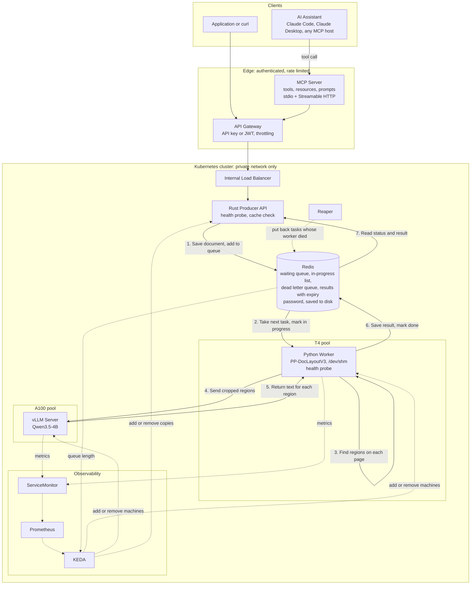

# Implementation Plan: Visual Understanding System

This document is the working plan for turning this repository from an inherited
teaching course into a production system with an MCP interface. It is the
tracking document for the work. Each phase has a checklist, and the status table
at the end records what is done.

Everything in the gap register below was verified against the actual files in
this repository, with file and line references given. Nothing here is assumed.
Where a claim depends on something outside the repository, the source is cited.

## Table of Contents

1. [What This Plan Changes](#1-what-this-plan-changes)
2. [The Current Architecture](#2-the-current-architecture)
3. [The Verified Gap Register](#3-the-verified-gap-register)
4. [The Target Architecture](#4-the-target-architecture)
5. [The New Architecture Diagram](#5-the-new-architecture-diagram)
6. [New Components Explained](#6-new-components-explained)
7. [The MCP Layer in Depth](#7-the-mcp-layer-in-depth)
8. [Implementation Phases](#8-implementation-phases)
9. [Progress Tracking](#9-progress-tracking)

---

## 1. What This Plan Changes

The system as inherited works, but it is a demonstration with production
ambitions rather than a production system. It loses work when a worker dies, it
cannot actually autoscale its most expensive component, it has no tests, it
stores secrets in plain text, and it has no interface for the AI agents it
claims to serve.

This plan closes those gaps in a defined order and adds the one capability that
makes the system genuinely distinctive: a Model Context Protocol server, so any
AI assistant can read documents through it as a native tool.

The headline changes:

| Area | Now | After |
| :--- | :--- | :--- |
| **Agent interface** | None. An MCP server is promised in the README but no code exists. | A full MCP server exposing tools, resources, and prompts, over stdio locally and Streamable HTTP in the cluster. |
| **Work durability** | A killed worker silently loses every task it holds. | Reliable queue with in-flight tracking, automatic recovery, bounded retries, and a dead letter queue. |
| **State durability** | Redis has no persistence, no password, one replica. A restart loses everything. | Persistence enabled, authentication required, results expire on a schedule. |
| **Autoscaling** | The A100 rule queried a metric nothing published, with an invalid parameter and a label that never matched, and could never have started the first pod anyway. | Metrics scraped, query corrected, and Redis-driven scale-from-zero, so the expensive pool scales on real demand. |
| **Failure reporting** | A failed document is marked `done` with empty output and no error. Confirmed in a live run. | Every failure recorded as `failed` with the real reason. Non-files rejected at the door. |
| **Health** | Only vLLM has probes. The API's `/health` endpoint is never called. | Probes on every component. |
| **Testing** | None of any kind. | Unit, integration, and end to end tests, running in CI. |
| **Secrets** | No Secret objects anywhere. Tokens are plain text in committed YAML. | Kubernetes Secrets, with the plaintext paths removed. |
| **Network** | Any pod in the cluster can reach Redis unauthenticated. | Network policies plus authentication. |
| **Efficiency** | Base64 inflates every payload by a third. No caching. | Binary storage, plus a content-hash cache that skips repeat work entirely. |
| **Naming** | `realtime_producer`, `realtime_consumer`, course framing, inherited branding. | `realtime_producer`, `realtime_consumer`, product framing, own identity and licence. |

---

## 2. The Current Architecture

This section describes what the existing architecture diagram
(`images/arch_overview.jpeg`) actually shows, because the new diagram is built
by modifying it rather than starting over.

### What the current diagram contains

**A title band** reading "SLM-Powered OCR on AKS" with the inherited branding in
the top right corner. Both must go.

**A platform services band** across the top, drawn as a container labelled Azure
Kubernetes Service, holding four boxes: KEDA for autoscaling, Prometheus for
metrics with Grafana and DCGM named underneath, ACR plus Blob PVC for storage,
and the NVIDIA GPU Operator for GPU management.

**A row of five main components**, connected left to right by solid numbered
arrows:

1. AI Agent, sending a PDF or image.
2. API Management, labelled ingestion and auth, tagged Internal VNet.
3. Rust API, labelled task orchestrator and queue producer, tagged `apinp` and CPU.
4. The Python worker, tagged `gpunpt4` and T4, listing the GLM-OCR SDK, the layout
   detection model, PP-DocLayoutV3, and a note that it calls vLLM for image and
   chart understanding.
5. The vLLM server, tagged `gpunpa100` and A100 80GB, running Qwen3.5-4B.

Arrows 4 and 5 form a loop between the worker and vLLM, labelled as the image and
chart description request going out and the enriched OCR context coming back.

**Four autoscaling callouts** drawn as dashed boxes above the components:
`CPU > 70%` over API Management, `queue >= 1` over the Rust API, `batch 4 / 100ms`
over the worker, and `waiting >= 1` over vLLM.

**A state store band** across the bottom, with Redis in the centre and a list of
what it holds: task queue, file storage as base64, OCR results, status and
metadata. Dashed arrows run down into it from the components above.

**Two feature boxes** beside Redis: GPU optimisations naming `/dev/shm`,
zero-copy, and RAM handoff; and vLLM features naming CUDA graphs, PagedAttention,
and continuous batching.

**A statistics panel** on the right claiming 1.86 pages per second,
`MAX_NUM_SEQS 512`, 262K batched tokens, and "MTP +50%".

**A legend** distinguishing solid request flow, purple dashed state and data
flow, and grey dashed autoscaling signals. **A benefits strip** along the bottom
reading event-driven, low latency, scalable, cost-efficient.

### What is wrong with it

Three things, beyond the branding.

**The MTP claim is false.** The panel advertises a 50 percent gain from
Multi-Token Prediction. It is not enabled. See gap 2.

**A state flow arrow runs from API Management down to Redis.** API Management
never touches Redis. Only the Rust API and the worker do.

**The autoscaling callout over the worker is not an autoscaling signal.**
`batch 4 / 100ms` describes the collector window, which is application behaviour,
not a KEDA trigger. The actual worker trigger is the same `queue >= 1` drawn over
the Rust API.

---

## 3. The Verified Gap Register

Every entry was confirmed by reading the file. The evidence column gives the
exact location so any claim here can be checked independently.

### Gaps carried forward from the system explanation

| # | Gap | Evidence | Severity |
| :--- | :--- | :--- | :--- |
| 1 | **No MCP server exists.** The README's Week 6 promises "wrapping the pipeline in an MCP server for Claude Code". No MCP code is present. | Repository-wide search for MCP source files returns nothing. `README.md:44` and `README.md:93` make the claim. | High. It is the flagship missing feature. |
| 2 | **Multi-Token Prediction is claimed but not configured.** | `server/entrypoint.sh:34-47` lists all twelve vLLM flags. None relate to MTP. A repository-wide search for `mtp`, `speculative`, `draft`, `ngram` returns zero matches. vLLM enables MTP via `--speculative-config '{"method":"mtp",...}'`. Claims appear at `README.md:39`, `README.md:134`, `README.md:147`, `README.md:170`. | High. It is a false performance claim published to readers. |
| 3 | **The README says MIT, the LICENSE file is Apache 2.0.** | `README.md:353` states MIT. `LICENSE:1-2` is the Apache License 2.0 text. | High. A licensing contradiction. |
| 4 | **`MAX_NUM_SEQS` has two different values.** | `server/entrypoint.sh:13` defaults to 256. `k8s/aks/kustomization.yml:37` and `k8s/gke/kustomization.yml:37` set 512. The ConfigMap wins at runtime, so the effective value is 512, but the container's own default contradicts every document. | Low. Confusing, not broken. |
| 5 | **`deployment-api.yml` also contains the worker deployment.** | `k8s/aks/apps/deployment-api.yml` holds `ocr-api-deployment` and, after the separator, `ocr-worker-rt-deployment`. | Low. Misleading filename. |
| 6 | **Redis has no persistence, no password, and one replica.** | `k8s/aks/apps/redis-deployment.yml:26` runs `redis:7-alpine` with no `args`, no `command`, and zero volumes. `replicas: 1`. | Critical. A pod restart destroys every in-flight job and every unretrieved result. |
| 7 | **No tests of any kind, and no CI.** | No file matching test, spec, or conftest exists anywhere. No `.github` directory. | High. Nothing can be changed safely. |
| 8 | **No retry and no dead letter queue.** | `realtime_consumer/worker.py:105` pops with `brpop`, removing the task from Redis immediately. If the pod is killed before the result is written, the task is gone. The `except` at line 76 only catches Python exceptions, not pod termination. | Critical. Silent data loss. |
| 9 | **Queue ordering is inconsistent.** | Producer uses `LPUSH` (`realtime_producer/src/main.rs`, the `lpush` call). Worker's first fetch uses `brpop` (oldest first) but the collector window uses `lpop` (`worker.py:120`), which takes newest first. | Low. Unfairness under load, not incorrectness. |
| 10 | **Base64 inflates every payload by roughly 33 percent.** | The Rust API encodes with `general_purpose::STANDARD.encode`, the worker decodes with `base64.b64decode` at `worker.py:38`. Redis is entirely in memory and billed by node size. | Medium. Pure waste. |
| 11 | **Results never expire.** | No `EXPIRE`, `SETEX`, or TTL call exists in either `worker.py` or `main.rs`. The `data` field is blanked at `worker.py:69` but the key itself lives forever. | Medium. Unbounded memory growth. |
| 12 | **Typo in the deployment guide.** | `docs/aks_deployment.md:54` reads "Downlaod AKS credentials". | Trivial. |
| 13 | **The guide's example output does not match the ingest job.** | `docs/aks_deployment.md:266` shows `Qwen3-VL-Embedding-2B` in the weights listing. `k8s/aks/infra/provisioning/ingest-job.yaml:23` downloads only `PaddlePaddle/PP-DocLayoutV3_safetensors` and `Qwen/Qwen3.5-4B`. | Trivial, but it makes readers think their deployment failed. |

### Additional gaps found during this deeper pass

These were not in the original list. Two of them are serious.

| # | Gap | Evidence | Severity |
| :--- | :--- | :--- | :--- |
| 14 | **The A100 autoscaler cannot fire.** The KEDA rule queries the Prometheus metric `vllm:num_requests_waiting`, but nothing in the repository tells Prometheus to scrape the vLLM pod. Searches for `ServiceMonitor`, `PodMonitor`, and `prometheus.io/scrape` across `k8s/` return nothing. | `k8s/aks/apps/keda-scaler.yml`, the `prometheus` trigger on `ocr-vlm-scaler`. No scrape configuration anywhere. | Critical. The single most expensive component has an autoscaling rule that silently never triggers. Only the cron warm-start works. |
| 15 | **No liveness or readiness probes on the API or the worker.** Only the vLLM deployment has them (`deployment-vlm.yml:37,43,48`). The Rust API exposes `/health` and nothing ever calls it. | `k8s/aks/apps/deployment-api.yml` contains no `Probe` of any kind for either deployment. | High. Kubernetes cannot detect a wedged API pod or a hung worker, and will keep routing traffic to it. |
| 16 | **No Kubernetes Secret objects anywhere. A Hugging Face token is a plaintext value in committed YAML.** | Searches for `kind: Secret`, `secretKeyRef`, and `secretName` across `k8s/` return nothing. `k8s/aks/infra/provisioning/ingest-job.yaml:30-31` defines `HF_TOKEN` as a literal `value:` with a comment telling the user to fill it in. | High. Follow the instruction as written and you commit a credential to git. |
| 17 | **Redis is reachable unauthenticated by every pod in the cluster, and there are no network policies.** | No `NetworkPolicy` exists anywhere in `k8s/`. Redis has no password (gap 6). Its Service is `ClusterIP`, which means cluster-wide reachable. | High. Any compromised pod reads and writes every document in the system. |
| 18 | **Every container runs as root.** The only `securityContext` in the repository adds the `IPC_LOCK` capability to vLLM. There is no `runAsNonRoot`, `runAsUser`, `allowPrivilegeEscalation`, or `readOnlyRootFilesystem` anywhere. | `k8s/aks/apps/deployment-vlm.yml:28` is the sole `securityContext`. | Medium. Standard hardening that is entirely absent. |
| 19 | **`--mm-encoder-tp-mode data` is inert.** The flag distributes the vision encoder across tensor-parallel ranks. The deployment requests one GPU and never sets `--tensor-parallel-size`, so tensor parallelism is 1. | `server/entrypoint.sh:42` sets the flag. `deployment-vlm.yml` requests `nvidia.com/gpu: "1"` with no TP argument. | Trivial. Harmless but misleading. |

### Gaps found during live testing

These two were not visible from reading the repository alone. They surfaced in the
first real end-to-end run on 16 September 2026, and were then confirmed by reading
the source code of the `glmocr` 0.1.4 SDK that the worker depends on.

| # | Gap | Evidence | Severity |
| :--- | :--- | :--- | :--- |
| 20 | **The worker reports success when the work failed.** The SDK signals failure without raising an exception, and the worker never checks for it. A failed document is marked `done`, with empty output and no error. The client has no way to tell. | **Observed live:** a task was stored as `status: done`, `result: {"markdown": "", "layout": []}`, `error: null`, while the worker log showed `[ERROR] glmocr.api: MaaS API error` for the same file. **Cause, in the SDK:** `glmocr/api.py` lines 294 to 307 catch the exception in MaaS mode and return an empty result with the error hidden in a private `_error` attribute. **Also affects production:** `glmocr/pipeline/pipeline.py` lines 446 to 455, in self-hosted mode, replace a region's text with an empty string and log only a warning when the vLLM request fails after its retries. A page can come back `done` with paragraphs or tables silently missing. **Cause, in our code:** `realtime_consumer/worker.py` lines 71 and 72 read the result fields and line 80 writes `done` unconditionally. Line 67 also stops early if the SDK returns fewer results than it was given, leaving the remaining tasks stuck at `processing` forever. | Critical. Silent data loss that looks like success. In self-hosted mode it produces output that is plausible but incomplete, which is harder to catch than an outright failure. |
| 21 | **The API accepts something that is not a file and queues it as a document.** A form field named `file` that carries plain text is stored as a PDF and sent for paid processing. | **Observed live:** a request missing curl's `@` sent the text of a file path instead of the file. The API returned `202 Accepted`, and Redis stored `filename: unknown.pdf`. The worker then sent those few bytes of text to the paid cloud API three times. The calls were only refused because the account had no balance. **Cause:** `realtime_producer/src/main.rs:116` substitutes the name `unknown.pdf` when no filename is present, rather than rejecting the request. Nothing checks that the bytes are actually a PDF or image. | High. Wastes paid API and GPU capacity on garbage, gives the user no signal that anything went wrong, and accepts arbitrary bytes into the processing path. |

### Gap found while writing the test harness

| # | Gap | Evidence | Severity |
| :--- | :--- | :--- | :--- |
| 22 | **An oversized upload from a client that declares no length is rejected as `400` rather than `413`.** Narrower than first recorded: when `Content-Length` is present, which is what curl, browsers, and every ordinary HTTP library send, the body limit layer already answers `413` before any handler runs. Only a streaming client that omits the length gets the multipart extractor's generic `400`. | Established by two tests in `realtime_producer/tests/api.rs`: `oversized_upload_with_content_length_gets_413` and `oversized_upload_without_content_length_is_still_rejected`. The Phase 1 test had omitted the header, which is why it saw 400. | Trivial. Correct outcome in every case; the code is only imprecise for an unusual client. Accepted as is. |

### Gaps found while building Phase 2 and 3

| # | Gap | Evidence | Severity |
| :--- | :--- | :--- | :--- |
| 23 | **vLLM could never scale from zero.** The only demand signal on the A100 scaler was vLLM's own `num_requests_waiting` metric. With zero vLLM pods there is nothing to scrape, so the metric is absent, so the trigger never fires. Only the business-hours cron could ever start the first A100; outside those hours the system could not process anything. | `k8s/*/apps/keda-scaler.yml` as inherited: the `ocr-vlm-scaler` had a cron trigger and a Prometheus trigger, nothing else. Independent of gap 14 (which is why the metric would be absent even with pods running). | Critical. Compounds gap 14. Fixed in Phase 3 with two Redis triggers on the vLLM scaler. |
| 24 | **The inherited KEDA Prometheus trigger used a parameter that no longer exists and a label that never matched.** `metricName` is not in the current KEDA scaler's parameter list, and the query filtered on `kubernetes_namespace="default"` where the Prometheus Operator attaches `namespace`. | KEDA prometheus scaler documentation (version 2.20) lists no `metricName`. Prometheus Operator labelling convention. | Medium. Even with gaps 14 and 23 fixed, the query would have matched nothing. Fixed in Phase 3. |
| 25 | **The SDK destroys the evidence of a failed region before the worker sees it.** In self-hosted mode a region whose recognition fails gets an empty string, and the result formatter then drops empty regions from `json_result`. The returned object is indistinguishable from a page that genuinely had fewer regions. | `glmocr/postprocess/result_formatter.py` lines 173 to 176 (skip empty content), `glmocr/pipeline/pipeline.py` lines 446 to 455 (empty string on failure). A non-200 response at line 451 is not even logged by the pipeline; only the HTTP client below it logs. | High. This is the mechanism behind gap 20's self-hosted half. Worked around in Phase 2 by counting the SDK's own final-failure log lines during each parse; the count is per batch, not per document. The correct fix is upstream: keep failed regions with an error marker. |

### External dependencies: verified real

To be certain the plan does not build on something imaginary, each external
dependency was checked directly. All of them exist as the repository specifies.

| Dependency | Result |
| :--- | :--- |
| `glmocr==0.1.4` on PyPI | Exists. Versions 0.1.1 to 0.1.5 published. The `selfhosted` and `layout` extras the Dockerfile requests are both declared. |
| `Qwen/Qwen3.5-4B` on Hugging Face | Exists, tagged image-text-to-text, confirming it accepts images. |
| `PaddlePaddle/PP-DocLayoutV3_safetensors` on Hugging Face | Exists. |
| `vllm/vllm-openai:v0.21.0` on Docker Hub | Exists as a multi-architecture tag. |
| `--load-format instanttensor` | A real vLLM flag for fast CUDA weight loading. |
| `--mm-encoder-tp-mode` | A real vLLM flag, though inert here. See gap 19. |
| MCP Python SDK (`mcp` on PyPI) | Exists. Requires Python 3.10 or higher. Supports stdio, Streamable HTTP, and SSE transports. |

---

## 4. The Target Architecture

The target keeps the two-stage pipeline exactly as it is, because that design is
sound and is the reason the system produces good output. Everything added is
about durability, observability, security, and reach.

### Flow diagram

### How to read the arrows

**Solid arrows** are the document's journey: a request or piece of data moving
from one component to the next. They are numbered in the order things happen.

**Dashed arrows** are background machinery: metrics being collected, scaling
decisions being made, abandoned work being recovered. None of them carry a
document, and none of them are triggered by a request.

**Direction** shows where the data goes, not who started the conversation.
Arrow 2 points from Redis to the worker because the task travels that way, even
though it is the worker that asks. Arrow 7 points from Redis to the API because
the result travels that way.

**Return paths are implied** for plain HTTP arrows. When a client sends a request
through the gateway and load balancer to the API, the reply comes back along the
same route, so a single arrow is enough. Where two components genuinely exchange
different things in each direction, such as the worker and vLLM, both arrows are
drawn and both are numbered.

### What changed from the current architecture

**Added at the edge:** the MCP server. It is a new front door specifically for AI
assistants, sitting alongside the existing HTTP interface rather than replacing
it.

**Added inside:** a reaper process that returns abandoned work to the queue, and
a ServiceMonitor that makes the metrics KEDA needs actually reach Prometheus.

**Changed in Redis:** the single `ocr_tasks` list becomes a set of structures. A
waiting queue, an in-progress list per worker, a dead letter queue, and result
keys that expire. Persistence and a password are switched on.

**Changed in the API:** health probes are wired up, and a content-hash lookup
short-circuits documents the system has already read.

**Unchanged:** the two-stage layout-then-read pipeline, the T4 and A100 split, the
`/dev/shm` handoff, the collector-window batching, and the internal-only network
posture. These were right.

---

## 5. The New Architecture Diagram

The diagram at `images/VUS.jpg` replaces the inherited `arch_overview.jpeg`. This
section is the specification it must satisfy, so the picture and the system
agree.

### The seven numbered arrows

| # | From | To | Plain-language label | What is happening |
| :--- | :--- | :--- | :--- | :--- |
| 1 | Rust API | Redis | Save document, add to queue | The API stores the file and its status in Redis and appends the task ID to the waiting queue. Once the cache exists, this arrow also covers "or return a saved result if this exact file was seen before". |
| 2 | Redis | Worker | Take next task, mark in progress | The worker asks for the oldest waiting task. Redis moves it from the waiting list to the in-progress list in a single step, so it is never in limbo. |
| 3 | Worker | Worker | Find regions on each page | Layout detection on the local T4 GPU. Pages become labelled boxes: text, table, formula, chart. |
| 4 | Worker | vLLM | Send cropped regions | Each region is cut out and sent to the A100 to be read. |
| 5 | vLLM | Worker | Return text for each region | The transcribed text comes back per region. |
| 6 | Worker | Redis | Save result, mark done | The worker assembles the pieces, writes the result with an expiry time, removes the task from the in-progress list, and sets the status to done. |
| 7 | Redis | Rust API | Read status and result | The client asks the API for the task's status. The API reads it from Redis and returns it along the same route the request came in on. |

Arrow 7 is the step the first draft of the diagram was missing. Without it the
story has no ending: the document goes in and the result never comes out.

### The dashed arrows

| From | To | Plain-language label |
| :--- | :--- | :--- |
| Reaper | Redis | Put back tasks whose worker died |
| vLLM | ServiceMonitor | Metrics |
| Worker | ServiceMonitor | Metrics |
| ServiceMonitor | Prometheus | (no label needed) |
| Prometheus | KEDA | (no label needed) |
| Redis | KEDA | Queue length |
| KEDA | Worker | Add or remove machines |
| KEDA | vLLM | Add or remove machines |
| KEDA | Rust API | Add or remove copies |

The Redis-to-KEDA arrow is real and easy to forget. KEDA reads the length of the
waiting queue straight from Redis to decide when to start a T4 worker. It does
not go through Prometheus for that. The A100 decision does go through
Prometheus, because it watches a vLLM metric.

### What each box must show

| Box | Must include |
| :--- | :--- |
| **Redis** | Its four structures, named in plain words: waiting queue, in-progress list, dead letter queue, results with expiry. A lock symbol for the password and a disk symbol for persistence. |
| **Rust API** | A health probe indicator and a cache check indicator. |
| **Worker** | PP-DocLayoutV3, `/dev/shm`, and a health probe indicator. |
| **vLLM** | Qwen3.5-4B. |
| **MCP Server** | Its three primitives (tools, resources, prompts) and both transports (stdio, Streamable HTTP). |
| **ServiceMonitor** | That it collects from both vLLM and the worker. |

### What must not appear

- The inherited logo or title.
- Any performance statistic that has not been measured on your own hardware,
  labelled with the hardware and date. The "MTP +50%" and "1.86 pages/s" claims
  from the old diagram are the reason this rule exists.
- Command names as labels. `BRPOPLPUSH` means nothing to a reader; "take next
  task, mark in progress" does. Technical detail belongs in the code, not the
  picture.

### A legend

Two entries are enough: a solid arrow labelled "the document's journey" and a
dashed arrow labelled "background machinery: scaling, metrics, recovery".

---

## 6. New Components Explained

### The reaper

**The problem it solves.** Today the worker takes a task off the queue with
`brpop`, which removes it from Redis in the same instant. If the pod dies a
moment later, from an out-of-memory kill, a node eviction, or a scale-down, the
task exists nowhere. The client polls forever on a task that no longer exists.

**How it is fixed.** The worker will use Redis's `BLMOVE` command, which takes
the oldest task off the waiting queue and puts it onto an in-progress list in a
single atomic step. The task is never in limbo. When the worker finishes, it
removes the entry from the in-progress list. If it dies, the entry stays there.

(The older name for this operation is `BRPOPLPUSH`. Redis deprecated it in
version 6.2 and its documentation says `BLMOVE RIGHT LEFT` is the equivalent.
This repository runs Redis 7, so the plan uses `BLMOVE`.)

The reaper is a small loop that watches those in-flight lists. If an entry has
been sitting there longer than a threshold, it moves it back to the pending
queue and increments a retry counter. Past a retry limit, it goes to the dead
letter queue instead, so a document that reliably crashes the worker does not
loop forever.

**The analogy:** the difference between a waiter taking your order and
immediately tearing up the ticket, versus keeping it clipped to the rail until
the food is actually served. If the waiter goes home mid-shift, the second
arrangement means someone else can pick up the order.

### The result cache

Documents repeat far more than people expect. The same form template, the same
invoice resubmitted, the same page in a batch that gets uploaded twice.

The API will hash the incoming file's bytes. If that hash has been seen and the
result is still stored, it returns the stored result immediately and never
touches a GPU. This is the cheapest possible performance win: not doing the work
at all.

### The ServiceMonitor

Prometheus does not discover things by magic. It scrapes what it is told to
scrape. A ServiceMonitor is the object that tells it. Without one, the vLLM
pod's metrics endpoint is never read, `vllm:num_requests_waiting` never appears
in Prometheus, and the KEDA rule that depends on it evaluates against nothing.

Adding it is a small file. Its absence is why the most expensive part of the
system currently cannot scale.

---

## 7. The MCP Layer in Depth

This is the flagship addition. This section is written to line up with the
concepts in the MCP guide at
[jonathanmuk.com/insights/model-context-protocol](https://www.jonathanmuk.com/insights/model-context-protocol),
so the article and this project reinforce each other.

### Where this system sits in the three roles

The guide defines three roles. This project builds exactly one of them.

| Role | Who plays it here |
| :--- | :--- |
| **MCP Host** | Claude Code, Claude Desktop, or a custom agent. Not built by us. |
| **MCP Client** | The connection manager inside that host. Not built by us. |
| **MCP Server** | **This is what we build.** It says "here are the things I can do" and exposes the document pipeline. |

The guide's framing applies directly: the server knows nothing about AI. It only
knows how to expose its capabilities in the standard format. Our server knows how
to submit a document and fetch a result. It does not know or care which model is
asking.

### Solving the M x N problem for document reading

The guide describes the M x N problem: M AI applications each needing custom
integrations to N tools. Document understanding is a textbook case. Without a
standard, every agent framework that wants to read a PDF through this pipeline
writes its own client, its own auth handling, its own polling loop.

With an MCP server, the pipeline is written once and every MCP-capable host gets
it. That is the USB-C port analogy made concrete for this system.

### The three primitives, mapped to this pipeline

The guide's control model is the key to designing these well: tools are
model-controlled, resources are application-controlled, prompts are
user-controlled. That determines what belongs where.

**Tools (the model decides when to call them):**

| Tool | Purpose |
| :--- | :--- |
| `read_document` | The main one. Takes a file path or URL, submits it, waits for completion, returns the Markdown and layout. Handles the polling internally so the assistant does not have to. |
| `submit_document` | Fire and forget. Returns a `task_id` immediately, for large documents where the assistant wants to do other work meanwhile. |
| `get_document_status` | Checks a `task_id`. Returns queued, processing, done, or failed. |
| `extract_structured_data` | Takes a document plus a JSON schema and returns data filling that schema. Depends on Phase 6. |

Tool descriptions get written with care. The guide is blunt about this and it is
correct: bad descriptions mean the AI misuses or ignores the tool, good
descriptions mean it uses it exactly right. The description for `read_document`
must say what document types are supported, what the output looks like, and when
to prefer it over `submit_document`.

**Resources (the application retrieves them as context):**

| Resource | URI |
| :--- | :--- |
| Result schema | `vus://schema/result` |
| Layout label reference | `vus://reference/layout-labels` |
| A finished document's Markdown | `vus://documents/{task_id}/markdown` |
| A finished document's layout JSON | `vus://documents/{task_id}/layout` |

The last two are resource templates in the guide's sense: URI patterns with
parameters, not fixed addresses. That lets an assistant reference a previously
processed document without re-reading it through a tool call.

**Prompts (the user invokes them, usually as slash commands):**

| Prompt | Arguments |
| :--- | :--- |
| `extract_invoice` | `document_path`, optional `currency` |
| `summarise_document` | `document_path`, `length` |
| `compare_documents` | `document_a`, `document_b` |

These become `/extract_invoice` and similar in a host that surfaces prompts as
slash commands. The value is the same one the guide identifies: consistency.
Instead of a different natural language phrasing every time and inconsistent
results, the user fills defined fields and gets a structured interaction.

### Long-running work: the Tasks pattern

This is the strongest connection between the guide and this project, and worth
calling out prominently.

The guide describes Tasks, the experimental MCP feature for long-running
operations: fire off an operation, get an identifier immediately, do other
things, check on it later, retrieve the result when complete. It notes the
analogy to Celery in Django.

**This pipeline already is that pattern.** `POST /process` returns a `task_id`
and HTTP 202. `GET /status/{task_id}` checks on it. The architecture was built
around exactly the shape MCP Tasks standardises. Mapping our `task_id` onto MCP's
task identifier is close to a direct translation rather than an adaptation.

Because Tasks is still experimental, the plan implements both: `read_document` as
a conventional blocking tool for ordinary documents, and the submit-plus-poll
pair for large ones, ready to become native Tasks when the feature stabilises.

### Progress notifications

The guide covers `notifications/progress` for long-running operations. This
pipeline can populate it meaningfully, because the worker already writes status
transitions into Redis. A fifty-page document can report queued, then processing,
then a page count as it advances, instead of leaving the assistant staring at
silence for a minute.

This uses the notification message shape the guide describes: a JSON-RPC message
with no `id` field, so no response is expected.

### Client features we will use

The guide's point that MCP is two-way matters here.

**Roots.** When a host opens a project folder, it tells connected servers that
this is the scope. Our server will respect roots when resolving local file paths,
so it will not read documents outside the folders the user has scoped it to. The
guide's caveat is important and will be documented in our README: roots are a
convention, not a hard security boundary. Real enforcement is our own path
validation, which we will implement rather than relying on the host.

**Elicitation.** Genuinely useful for `extract_structured_data`. If an assistant
asks for structured extraction without specifying a schema, the server can pause
and ask the user which document type this is, rather than guessing or failing.
That is the guide's flight-booking example applied to documents.

**Sampling.** Noted as a future possibility, not in scope. A server could ask the
host's model to pick which pages of a two-hundred-page document are relevant
before processing all of them. The guide is right that it is advanced and not
needed in a first build.

### Transport, and one correction to flag

The guide's practical rule holds: start with stdio, move to remote for shared
deployment. Our plan does exactly that. Phase 4 builds stdio first for local
development, then adds the remote transport for the cluster deployment.

**One point to update in the article.** The guide describes the remote transport
as "HTTP with SSE (Server-Sent Events)". That was the transport name in protocol
version 2024-11-05. It was deprecated in the 2025-03-26 revision and replaced by
**Streamable HTTP**, which uses a single endpoint accepting both POST and GET, and
which may optionally use Server-Sent Events to stream server-to-client messages.
SSE is now a mechanism inside Streamable HTTP, not a transport alongside it.

The guide already cites `protocolVersion: "2025-11-25"` in its handshake
examples, so the rest of it is current. Only the transport section needs the
name updated. This project will implement Streamable HTTP, and the README will
use that name, so that a reader moving between the article and the code is not
confused.

### Versioning

Following the guide's advice: pin to the current spec, not draft. The server will
declare `protocolVersion` explicitly in its initialize response, and the version
will be recorded in the README so it is obvious when a review is due.

### Deployment shape

The guide's production checklist is the checklist for Phase 4:

| Guide's requirement | How this project meets it |
| :--- | :--- |
| Move from stdio to remote transport | Streamable HTTP behind the same internal load balancer and API gateway as the REST API. |
| Add proper authentication | The gateway's existing JWT and API key validation, with the token carried in HTTP headers. |
| Add observability, logging each tool call | Structured logs per tool call, with the `task_id` as the correlation key across the MCP server, the API, and the worker. |
| Version pin to the current spec | Declared in the initialize response and documented. |

---

## 8. Implementation Phases

Phases are ordered by engineering dependency, not by convenience. Phase 0 comes
first because everything else references file paths that Phase 0 changes. The
reliability work comes before the MCP server because an MCP tool built on a
pipeline that loses tasks is an unreliable tool.

You can resequence, but be aware of the dependencies noted on each phase.

---

### Phase 0: Repository Foundation

**Status: complete, 19 September 2026** (one item left for the owner, marked below).

**Goal:** the repository becomes yours, with consistent naming, before any code
changes.

**Depends on:** nothing. Do this first.

**Why first:** the folder renames touch paths referenced in Dockerfiles,
deployment guides, and the README. Doing this after other work means redoing it.

- [x] Git remote points at the owner's repository
      (`jonathanmuk/Visual-Understanding-System`). Done by the owner.
- [x] Rename `client_rt_producer` to `realtime_producer`. Done with `git mv` so
      history follows the files.
- [x] Rename `client_rt_consumer` to `realtime_consumer`. Same.
- [x] Update every reference to those paths: 31 references across `.gitignore`,
      both deployment guides, the README, and the three analysis documents.
- [x] Replace the `managed-by: gemini-cli-agent` label in both
      `kustomization.yml` files. Now `managed-by: kustomize` and
      `system: visual-understanding-system`. Verified with `kubectl kustomize`.
- [x] Replace the hardcoded registry. Done more thoroughly than planned: the
      manifests now use bare image names (`ocr-api-rust`, `ocr-worker-rt`,
      `ocr-vlm-qwen`) and each `kustomization.yml` has an `images:` block that
      sets the registry in one place. Placeholders are `<YOUR_ACR_NAME>` for
      Azure and `<YOUR_PROJECT_ID>` for Google Cloud. Verified with
      `kubectl kustomize` that all three images are rewritten correctly.
- [x] Fix gap 3: the README now states Apache 2.0, matching `LICENSE`.
- [x] Add a `NOTICE` file crediting the original Apache-2.0 work and stating your
      copyright.
- [x] Add a derived-work statement to the README (section 9).
- [x] Remove the inherited newsletter block, contributor table, and the two
      Substack pointers. The pointers now direct readers to section 7 of
      `next-steps.md`.
- [x] Fix the two broken `file:///Users/hedrergudene/...` links. Now relative.
- [x] Remove the "At EMDI" reference.
- [x] Remove emojis: 58 removed across 12 files, including the log messages in
      `worker.py`, the `println!` in `main.rs`, `entrypoint.sh`, and both ingest
      jobs.
- [x] Replace em-dashes, en-dashes, and non-breaking hyphens: 39 replaced across
      7 files, each rewritten as a full sentence, comma, or colon rather than a
      blind substitution.
- [x] Images: the six weekly course images and the two inherited diagrams are
      deleted. `images/VUS.jpg` is the architecture diagram and the README
      displays it.
- [x] Promote `README2.md` to `README.md`. The two "magic bytes" paragraphs were
      corrected on the way (the SDK chooses by file extension, not content), and
      four sections were appended: repository layout, getting started, project
      status, licence and attribution.
- [x] Trim comments in `main.rs` and `worker.py`. Behaviour is unchanged. The
      comments that remain explain a decision: the body-size ceiling, the atomic
      `HSET`, the `/dev/shm` choice, the `0o644` permission, the collector
      window, and the one-batch-at-a-time rule.
- [x] Removed the residual "course" wording from the four onboarding and
      prerequisite documents.

**Verified by:** `grep -r "neural-maze\|theneuralmaze\|client_rt_"` returns
matches only in `NOTICE` (the attribution) and the analysis documents (as
history). `kubectl kustomize k8s/aks/` and `k8s/gke/` both build. All Kubernetes
YAML parses. `worker.py` and `entrypoint.sh` pass syntax checks. The Rust API
compiles inside its Dockerfile (see the Phase 0 test notes in the summary).

---

### Phase 1: Truth, Consistency, and a Test Harness

**Status: complete, 19 September 2026** (one fixture item waits on a successful
Track 1 run, marked below).

**Goal:** everything the repository says is true, and there is a safety net
before anything risky changes.

**Depends on:** Phase 0.

**Correctness fixes:**

- [x] Gap 4: `entrypoint.sh` now defaults `MAX_NUM_SEQS` to 512, matching the
      ConfigMap and every document.
- [x] Gap 5: `deployment-api.yml` now holds only the API. The worker lives in a
      new `deployment-worker.yml`, in both `k8s/aks/` and `k8s/gke/`. Both
      `kustomization.yml` files list it. Verified with `kubectl kustomize`: all
      four Deployments still render.
- [x] Gap 12: "Downlaod" corrected.
- [x] Gap 13: the example weights listing now shows exactly the two models the
      ingest job downloads, with file names taken from each model's Hugging Face
      repository rather than guessed.
- [x] Gap 19: `--mm-encoder-tp-mode data` is kept, with a comment explaining it
      is inert at tensor parallelism 1 and why it stays.
- [x] Gap 2: the last remaining MTP claim, in `docs/cloud_comparison.md`, is
      removed. No MTP or throughput claim remains anywhere in the README or
      docs. Enabling MTP for real is deferred to Phase 5, where it can be
      measured.

**Test harness:**

- [x] The Rust API is restructured into `src/lib.rs` (router and handlers) and
      a thin `src/main.rs`, so tests can drive the router in-process without
      binding a port. One behaviour change, deliberate and safe: the Redis
      connection is now opened only when there is something to store, so a
      malformed request is rejected without Redis being involved.
- [x] Rust tests, 10 in total: three unit tests on filename handling, and seven
      integration tests in `tests/api.rs` covering health, missing file field,
      non-multipart body, oversized upload, unknown route, unknown task, and a
      full submit-then-status round trip that also checks what landed in Redis
      byte for byte. The two Redis-dependent tests skip cleanly when `REDIS_URL`
      is unset, so `cargo test` passes on a laptop with no Redis.
- [x] The Python worker is restructured so the Redis client and the SDK engine
      are created in `main()` and passed in, and the collector window is its own
      function. The module can now be imported and tested without the SDK
      installed. Behaviour is unchanged.
- [x] Python tests, 13 at the time, using `fakeredis`: three on the collector
      window, seven on batch processing, and three gap 20 behaviours written as
      they *should* behave and marked `xfail(strict=True)`. (Phase 2 fixed gap 20
      and those three became ordinary passing tests; the suite is now 22.)
- [x] Container smoke test: `docker-compose.test.yml` starts Redis and the
      built API image; `tests/integration/smoke.py` runs 21 checks against
      them, including that stored bytes round-trip exactly and that a PNG and a
      PDF both work. Passes locally.
- [x] GitHub Actions workflow with four jobs: Rust tests against a Redis service
      container, Python tests, the container smoke test, and a check that both
      Kustomize trees still build. Every action and version tag referenced was
      verified to exist.
- [x] Fixtures: a hand-generated 601-byte PDF and 71-byte PNG, with no licensing
      questions.
- [ ] **Waits on Track 1:** three real documents with reviewed expected output.
      Cannot be produced until an end-to-end run succeeds. `tests/fixtures/README.md`
      describes exactly what to add.

**Verified by:** `cargo test` (10 passed, run inside the official Rust image
with a Redis alongside), `pytest` (10 passed, 3 xfailed), `smoke.py` (21 checks
passed against the freshly built image), `kubectl kustomize` on both trees.

---

### Phase 2: Reliability Core

**Status: complete, 19 September 2026.**

**Goal:** the system stops losing work, and stops lying about it.

**Depends on:** Phase 1's test harness.

**Queue durability (gaps 8 and 9):**

- [x] The worker claims with `BLMOVE ocr_tasks ocr_tasks:processing RIGHT LEFT`,
      so a task moves from the waiting queue to the in-progress list in one
      atomic step. `BRPOPLPUSH` is not used: Redis deprecated it in 6.2.
- [x] The in-progress entry is removed only after the result, or the failure, is
      written. `finish_done` and `finish_failed` in `vus_queue.py` do both.
- [x] The collector window uses the same direction (`LMOVE RIGHT LEFT`), so a
      batch is consistently oldest-first. Verified by
      `test_collect_batch_fills_oldest_first_and_moves_all_to_processing`.
- [x] `attempts` is incremented on every claim (`mark_claimed`).
- [x] Dead letter queue `ocr_tasks:dead`, with the error preserved on the task
      hash. A task is dead-lettered after `MAX_ATTEMPTS` (default 3), or
      immediately for an error that cannot succeed on retry.
- [x] The reaper: `realtime_consumer/reaper.py`, its own tiny image
      (`Dockerfile.reaper`, Python slim, no CUDA), one replica on the CPU pool.
      Every `REAPER_INTERVAL_SECONDS` it scans the in-progress list; a claim
      older than `STALE_AFTER_SECONDS` is requeued at the front, or dead-lettered
      if out of attempts. A claim with no task data is dropped. Design note: one
      shared in-progress list with a `claimed_at` stamp per task, rather than a
      list per worker, so the reaper needs no registry of live workers.

**State durability (gaps 6 and 11):**

- [x] Redis runs `--appendonly yes` on a `PersistentVolumeClaim`, with
      `strategy: Recreate` because the disk is ReadWriteOnce.
- [x] Redis requires a password (`--requirepass`) read from the Kubernetes
      Secret `ocr-redis-secret`. The API, worker, reaper, and KEDA (through a
      `TriggerAuthentication`) all read the same Secret. Locally the password is
      optional so Track 0 and Track 1 still work unchanged.
- [x] Every finished task, done or failed, gets `EXPIRE RESULT_TTL_SECONDS`
      (default one day, in the ConfigMap).
- [x] Durability posture documented in the Redis manifest: a durable queue and
      result cache, not a system of record.

**Honest results (gaps 20, 21, 22, 25):**

- [x] `evaluate_result` in `worker.py` checks every SDK result: `_error` set,
      result missing, or empty output all count as failure, with the reason.
- [x] Fewer results than inputs: the missing ones are failed, never left at
      `processing`. Verified by `test_fewer_results_than_tasks_never_leaves_a_task_at_processing`.
- [x] Self-hosted partial failures: `FailedRegionCounter` attaches to the SDK's
      `glmocr` logger during each parse and counts its final-failure lines
      (`Received bad status code`, `Error during recognition`, `Recognition failed`),
      ignoring retry lines. A non-zero count puts a `warning` on every task in
      the batch and increments `vus_regions_failed_total`. Per batch, not per
      document; see gap 25 for why that is the best available from outside the
      SDK.
- [x] `is_non_retryable` in `vus_queue.py` matches Z.ai codes 1113, 1000, 1001,
      1003 and `MissingApiKeyError`; those fail immediately with "not retried"
      in the error. Everything else is retried up to `MAX_ATTEMPTS`.
- [x] The API rejects a `file` field with no filename with `400` and a message
      that names the `@` fix. Verified by
      `text_in_the_file_field_is_rejected_with_a_helpful_message`.
- [x] The API reads the first bytes and accepts only PDF, PNG, and JPEG; anything
      else is `415`. An empty file is `400`. The stored `extension` comes from the
      detected content, never from the filename; verified by
      `stored_extension_comes_from_content_not_filename` with a PDF named `.jpg`.
- [x] `413` for oversized uploads that declare a length, which every ordinary
      client does. Gap 22 narrowed to the no-length case and accepted as is.
- [x] The three former `xfail` tests now pass as ordinary assertions, and the
      exact 16 September failures are test inputs: the `1113` billing refusal,
      the path-as-text upload, the empty result.

**Health (gap 15):**

- [x] API: `livenessProbe` on `/health`, `readinessProbe` on the new `/ready`,
      which pings Redis. A pod whose Redis is unreachable takes no traffic.
- [x] Worker: a heartbeat file touched every 5 seconds from the event loop, which
      keeps running during a long parse because the parse is in a thread. An
      `exec` probe checks the file is under a minute old. A `startupProbe` allows
      five minutes for the SDK and layout model to load.
- [x] Reaper: `livenessProbe` on its metrics port.
- [x] Redis: liveness and readiness through `redis-cli ping` with the password.

**Verified by:** 22 Python tests (`pytest`), including
`test_worker_killed_mid_batch_task_still_completes`, which is the plan's "done
when" scenario executed against a fake Redis: claim, die, reaper requeues, next
worker completes on attempt 2. 17 Rust tests. The 47-check container smoke test
runs the real reaper against a real password-protected, persistent Redis and
watches it requeue a stale claim and dead-letter an exhausted one, and confirms
the API's every rejection path and the resulting metrics. Run three times from a
clean start with identical results.

**Not verified here:** `kubectl delete pod` on a real cluster. The same sequence
is tested at the unit and container level; the cluster run is described in the
deployment guides under "Verify the reliability pieces".

---

### Phase 3: Observability and Working Autoscaling

**Status: complete, 19 September 2026** (cluster verification pending, marked
below).

**Goal:** the metrics loop actually closes, so the expensive pool scales.

**Depends on:** Phase 2.

- [x] Gap 14: `ServiceMonitor` objects for vLLM, the worker, the reaper, and the
      API, in `k8s/*/observability/servicemonitors.yml`. The vLLM and API
      Service ports are now named (`http`) so the monitors can reference them.
- [x] Gap 24: the vLLM scaler's Prometheus trigger no longer uses `metricName`
      (not a valid parameter in current KEDA) and filters on `namespace`, the
      label the Prometheus Operator attaches, instead of `kubernetes_namespace`.
      `ignoreNullValues` is set so "no vLLM yet" reads as zero rather than an
      error.
- [x] Gap 23: two Redis triggers on the vLLM scaler, on the waiting queue and the
      in-progress list, with `listLength` set high so each asks for exactly one
      replica when anything is pending. This is what gets vLLM from zero to one;
      the Prometheus trigger then decides whether more are needed. Both use the
      same `TriggerAuthentication` as the worker scaler.
- [x] Worker metrics on `:9100/metrics`: `vus_batch_size`, `vus_stage_seconds`
      by stage (prepare, parse, write), `vus_tasks_total` by outcome (done,
      requeued, failed, orphan), `vus_regions_failed_total`.
- [x] Reaper metrics: `vus_queue_depth` by queue (waiting, processing, dead),
      `vus_reaper_actions_total` by action. The reaper publishes the depths
      because it is the one process guaranteed to be running when the workers
      are scaled to zero.
- [x] API metrics on `/metrics`: `vus_http_requests_total` by route pattern and
      status (route pattern, not raw path, so task IDs do not explode the label
      set), `vus_uploads_rejected_total` by reason, `vus_upload_bytes` by
      detected type. Known label sets are created at startup so dashboards see
      zero rather than no data.
- [x] Structured JSON logging in all three services when `LOG_FORMAT=json` (set
      in the ConfigMap), with `task_id` bound on every task-related line.
- [x] Grafana dashboard **Visual Understanding System**, ten panels, delivered as
      a ConfigMap the kube-prometheus-stack sidecar loads automatically. JSON
      validated.
- [x] Five alerts as a `PrometheusRule`: dead letter queue growing, queue not
      draining, claimed tasks not finishing, vLLM absent while work waits, model
      failing on many regions.
- [x] DCGM exporter and its ServiceMonitor stated explicitly in the GPU Operator
      values (they are on by default in the chart; now nobody has to wonder).
- [x] The deployment guides gained: the Secret creation step, the reaper image
      build, a verification section that queries Prometheus for the four
      targets, and the kill-a-worker acceptance test.
- [ ] **Cluster verification, owner action:** submit a burst of documents and
      watch the A100 pool scale from zero, up, and back down in Grafana. Every
      manifest builds and every object renders identically on both clouds, but
      scaling behaviour can only be observed on real hardware. The
      "done when" for this phase is therefore not yet observed.

**Verified by:** `kubectl kustomize` on both clouds (22 objects each, identical
kinds and names, checked by a new CI step). All YAML parses. Dashboard JSON
parses. The API's metrics endpoint is exercised by 4 Rust tests and 5 smoke
checks; the reaper's by 3 smoke checks. KEDA parameter names and the
`TriggerAuthentication` shape were checked against the KEDA documentation for
the redis-lists and prometheus scalers.

---

### Phase 4: The MCP Server

**Goal:** any MCP-capable assistant can read documents through this pipeline.

**Depends on:** Phase 2. An agent-facing tool must not silently lose work.

**Build it in a new top-level `mcp_server/` directory.**

- [ ] Scaffold the server with the Python MCP SDK. Requires Python 3.10 or
      higher.
- [ ] Implement the lifecycle handshake: respond to `initialize` declaring the
      protocol version and the capabilities offered (tools, resources, prompts),
      and handle `notifications/initialized`.
- [ ] Implement `tools/list` returning the four tool definitions, each with a
      complete `inputSchema` and a description written for a model to read, not a
      human to skim.
- [ ] Implement `tools/call` for `read_document`, `submit_document`,
      `get_document_status`, and (deferred to Phase 6) `extract_structured_data`.
- [ ] Implement `resources/list`, `resources/templates/list`, and
      `resources/read` for the four resources, including the two templated ones.
- [ ] Implement `prompts/list` and `prompts/get` for the three prompt templates.
- [ ] Emit `notifications/progress` during long documents, driven by the status
      transitions already recorded in Redis.
- [ ] Honour roots when resolving local file paths, and implement your own path
      validation rather than trusting roots as a security boundary.
- [ ] Add elicitation for `extract_structured_data` when the schema is ambiguous.
- [ ] Support stdio transport for local use.
- [ ] Add Streamable HTTP transport for the deployed server, with bearer token
      authentication in the headers.
- [ ] Structured log per tool call, correlated by `task_id`.
- [ ] Containerise it and add a Kubernetes deployment on the CPU pool. It is
      lightweight and must not land on a GPU node.
- [ ] Write the connection instructions for Claude Code and Claude Desktop into
      the README.
- [ ] Test it end to end: connect from a real assistant and ask it to read a
      document.

**Done when:** you can say "read this invoice and tell me the total" to an
assistant and it works.

---

### Phase 5: Performance and Efficiency

**Goal:** measurably faster and cheaper, with numbers to prove it.

**Depends on:** Phase 3, because you cannot show improvement without measurement.

- [ ] Establish the baseline first. Record pages per second, cold start time, and
      cost per thousand pages before changing anything.
- [ ] Gap 10: replace base64 with binary storage in Redis. Redis handles binary
      natively. This removes a third of the memory traffic and two encode/decode
      passes per document. Verify the Rust and Python sides agree on the encoding.
- [ ] Remove the unused PDF dependencies from the worker image. The Dockerfile
      installs `PyMuPDF`, `pdf2image`, and `poppler-utils`, but the SDK renders
      PDFs with pypdfium2 and nothing imports the other two. Rebuild, rerun the
      tests, and record the image size before and after.
- [ ] Add the content-hash result cache. Hash on upload, return the stored result
      on a hit, and skip the GPU entirely.
- [ ] Build a load test that submits a realistic burst and reports throughput and
      latency percentiles.
- [ ] Tune the collector window. The 100 ms and batch size of 4 are inherited
      guesses. Measure whether they are right for your documents.
- [ ] Evaluate MTP properly if you enabled it in Phase 1, comparing throughput at
      low and high concurrency.
- [ ] Re-measure everything and publish the honest numbers, labelled with the
      hardware they were measured on.

**Done when:** the architecture diagram's statistics panel contains numbers you
generated yourself.

---

### Phase 6: The Intelligence Layer

**Goal:** better output, not just faster output. This is where domain
specialisation happens.

**Depends on:** Phase 5's evaluation tooling.

- [ ] Build an evaluation harness first: a set of documents with known correct
      output, scored automatically. Without this, every subsequent change is a
      guess.
- [ ] Rewrite the four prompts in `config.yaml` for your chosen domain. This is
      the highest impact-to-effort change in the entire repository.
- [ ] Move `chart` out of the `skip` bucket and give it a chart-specific prompt,
      so graphs are described rather than silently dropped.
- [ ] Review the `abandon` list. If your documents carry meaningful information
      in headers, such as a case or invoice number, stop discarding them.
- [ ] Add `extract_structured_data`: a stage that takes the assembled Markdown
      and a JSON schema and returns filled structured data. This converts a
      document reader into a data extraction system, which is what most real
      applications need.
- [ ] Add a webhook callback so clients are pushed results instead of polling.
- [ ] Consider object storage for source documents if you need an audit trail.
- [ ] Tune `pdf_dpi`, `threshold`, and `use_polygon` against your evaluation set.
      Turn on `use_polygon` if you handle photographed or skewed documents.

**Done when:** your evaluation score is measurably better than the Phase 5
baseline on your own documents.

---

### Phase 7: Security Hardening

**Goal:** defensible under review.

**Depends on:** Phase 4, so the MCP server is included in the hardening.

- [ ] Gap 16: create Kubernetes Secrets for the Hugging Face token, the Redis
      password, and any API keys. Remove the plaintext `HF_TOKEN` value from
      `ingest-job.yaml` and reference a Secret instead. Confirm no credential has
      ever been committed; if one has, rotate it.
- [ ] Gap 17: add NetworkPolicies. Redis should accept connections only from the
      API, the worker, and the reaper. The vLLM service should accept connections
      only from the worker.
- [ ] Gap 18: add a `securityContext` to every deployment with `runAsNonRoot`,
      an explicit `runAsUser`, `allowPrivilegeEscalation: false`, and dropped
      capabilities. The Rust container is a static binary in Alpine and should
      run as non-root trivially. The GPU containers need more care.
- [ ] Add `readOnlyRootFilesystem` where practical, with explicit writable mounts
      for `/dev/shm` and temp paths.
- [ ] Confirm the upload validation from Phase 2 (gap 21) holds under hostile
      input: truncated files, files with a valid header but corrupt contents, and
      files at exactly the 10 MB limit.
- [ ] Review the API gateway policy. The current rate limit of 100 calls per
      minute is a reasonable default; confirm it suits your expected load and
      your cost tolerance.
- [ ] Add authentication to the MCP server's HTTP transport, and document the
      token issuance process.
- [ ] Add dependency scanning to CI for both the Rust and Python trees.
- [ ] Run through the security review checklist and record the outcome.

**Done when:** no credentials in git, no container running as root, and no
unauthenticated path to Redis.

---

### Phase 8: Documentation and Release

**Goal:** someone else can use this.

**Depends on:** everything.

- [ ] Update `README.md` for every change, keeping the plain-language style and
      the analogies.
- [ ] Update `system-explanation.md`, particularly section 13, marking each gap
      as resolved.
- [ ] Rewrite the deployment guides to match the new manifests.
- [ ] Write the MCP setup guide, including the connection configuration for
      Claude Code and Claude Desktop.
- [ ] Document the measured performance with the hardware and date.
- [ ] Add an architecture decision record for the significant choices: why
      two-stage, why the reliable queue pattern, why MCP.
- [ ] Publish the corrected architecture diagram.
- [ ] Tag a release.

---

## 9. Progress Tracking

Update this table as phases complete.

| Phase | Name | Gaps closed | Status | Notes |
| :--- | :--- | :--- | :--- | :--- |
| 0 | Repository Foundation | 3 | Complete | Git remote set by owner, 19 Sep |
| 1 | Truth, Consistency, Tests | 2, 4, 5, 7, 12, 13, 19 | Complete | OCR fixtures wait on Track 1 |
| 2 | Reliability Core | 6, 8, 9, 11, 15, 20, 21, 22, 25 | Complete | Cluster kill-test still to observe |
| 3 | Observability and Autoscaling | 14, 23, 24 | Complete | Scale-up on real hardware still to observe |
| 4 | The MCP Server | 1 | Not started | The flagship feature |
| 5 | Performance and Efficiency | 10 | Not started | Baseline first |
| 6 | The Intelligence Layer | none, additive | Not started | Where domain value lives |
| 7 | Security Hardening | 16, 17, 18 | Not started | |
| 8 | Documentation and Release | none, additive | Not started | |

### Gap coverage check

Every gap in the register is assigned to a phase. Nothing is orphaned.

| Gap | Phase | Gap | Phase |
| :--- | :--- | :--- | :--- |
| 1 MCP server missing | 4 | 11 No result expiry | 2 |
| 2 MTP claim false | 1 | 12 Guide typo | 1 |
| 3 Licence contradiction | 0 | 13 Guide output mismatch | 1 |
| 4 MAX_NUM_SEQS mismatch | 1 | 14 A100 scaler cannot fire | 3 |
| 5 Manifest file misnamed | 1 | 15 Missing probes | 2 |
| 6 Redis not durable | 2 | 16 Secrets in plaintext | 7 |
| 7 No tests | 1 | 17 No network policies | 7 |
| 8 No retry or DLQ | 2 | 18 Containers run as root | 7 |
| 9 Queue ordering | 2 | 19 Inert vLLM flag | 1 |
| 10 Base64 overhead | 5 | 20 Failures reported as success | 2 |
| | | 21 Non-files accepted as documents | 2 |
| | | 22 Wrong status for oversized upload | 2 (narrowed, accepted) |
| | | 23 vLLM cannot scale from zero | 3 |
| | | 24 Invalid KEDA parameter and label | 3 |
| | | 25 SDK hides failed regions | 2 (worked around) |

---

## Sources

External claims were verified against:

- [glmocr on PyPI](https://pypi.org/project/glmocr/)
- [Qwen/Qwen3.5-4B on Hugging Face](https://huggingface.co/Qwen/Qwen3.5-4B)
- [PaddlePaddle/PP-DocLayoutV3_safetensors on Hugging Face](https://huggingface.co/PaddlePaddle/PP-DocLayoutV3_safetensors)
- [vllm/vllm-openai on Docker Hub](https://hub.docker.com/r/vllm/vllm-openai/tags)
- [vLLM MTP documentation](https://docs.vllm.ai/en/latest/features/speculative_decoding/mtp/)
- [vLLM speculative decoding](https://docs.vllm.ai/en/latest/features/speculative_decoding/)
- [vLLM InstantTensor](https://docs.vllm.ai/en/latest/models/extensions/instanttensor/)
- [vLLM engine arguments](https://docs.vllm.ai/en/stable/configuration/engine_args/)
- [MCP transports specification, 2025-11-25](https://modelcontextprotocol.io/specification/2025-11-25/basic/transports)
- [MCP Python SDK on PyPI](https://pypi.org/project/mcp/)
- [Redis BRPOPLPUSH, deprecated as of 6.2.0](https://redis.io/docs/latest/commands/brpoplpush/)
- [Redis BLMOVE, the replacement](https://redis.io/docs/latest/commands/blmove/)
- [Model Context Protocol, jonathanmuk.com](https://www.jonathanmuk.com/insights/model-context-protocol)
